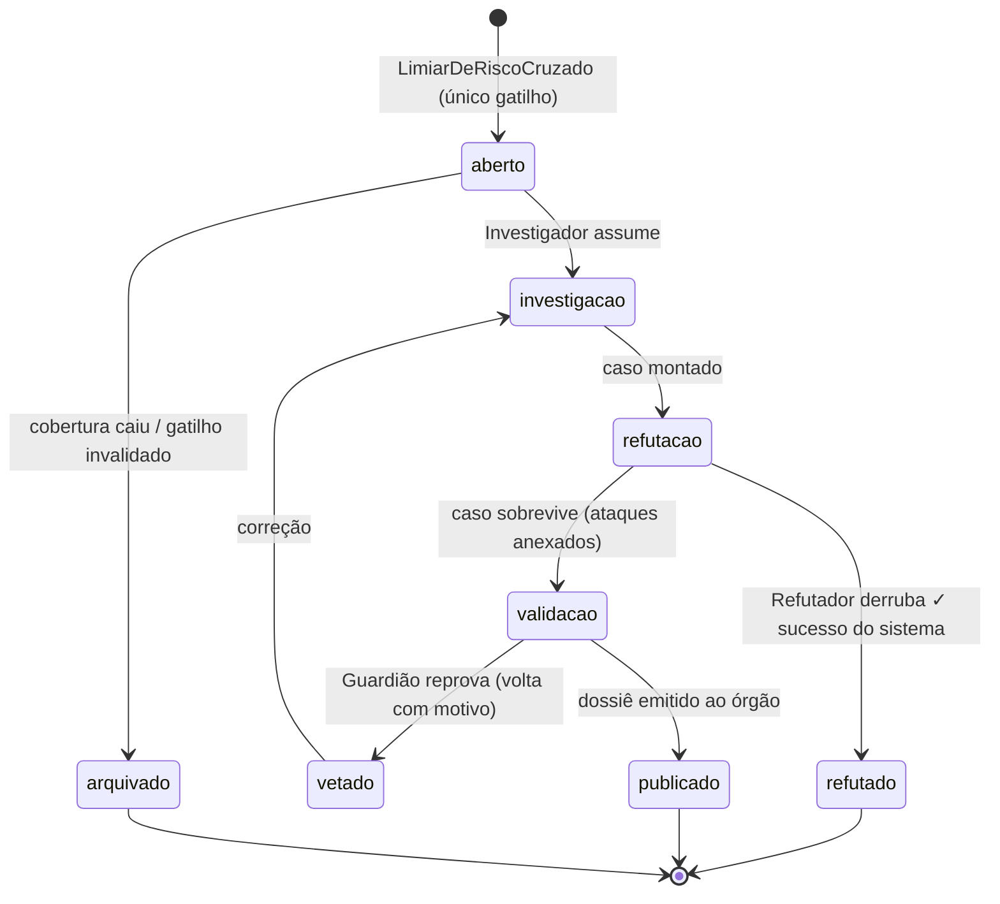

# Pipeline do Caso

*(especificação inicial)* — o ciclo de vida do agregado `Caso`: uma corrente com veto (Chain of Responsibility) onde **refutação é desfecho de sucesso**.

## Máquina de estados

Eventos emitidos: [`caso-transicoes`](../dados/eventos/caso-transicoes.md). Toda transição vai à trilha.

## O que cada etapa é obrigada a produzir

| Etapa | Artefato obrigatório | Sem ele |
|---|---|---|
| Abertura | Referência ao evento gatilho + score, cobertura e razões da origem | Caso não nasce — não existe caso "por intuição" |
| Investigação | Linha do tempo; evidências **cada uma com localizador**; corroboração entre fontes distintas quando existir | Não avança à refutação |
| Refutação | Resposta registrada a **cada item** do roteiro de ataque ([catálogo](catalogo.md)) | Aprovação por omissão é proibida |
| Validação | Checklist do Guardião aprovado | Não existe publicação — invariante zero-bypass |
| Publicação | Dossiê completo (abaixo) + `CasoPublicado` | — |

## Seções obrigatórias do dossiê

1. **Achado** — o que a evidência sustenta, na linguagem permitida.
2. **Evidência** — cada item com fonte, data e localizador (linhagem até a origem).
3. **Hipóteses alternativas testadas** — as refutações tentadas e por que não prosperaram. *A seção que faz um fiscal confiar no resto.*
4. **O que não se pode afirmar** — limites explícitos (intenção, causa, prevalência).
5. **Cobertura e contexto** — quanto dado sustenta o caso; o que falta.
6. **Recomendação** — sempre e somente: verificação pelo procedimento competente.
7. **Rastreabilidade técnica** — versões (modelo, snapshot, cluster) que geraram o caso.

## Prazos-alvo (especificação; calibrar no piloto)

Abertura→investigação: 24h · investigação: 72h · refutação: 48h · validação: 24h. Caso parado além do dobro do prazo → alerta do Curador; a idade da fila é telemetria pública interna.

## Intervenção humana

- Fiscal pode **pedir** caso sobre um posto — entra como gatilho manual registrado (quem, por quê), e percorre a corrente inteira: pedido humano não pula o Refutador.
- Analista humano pode assumir qualquer etapa; a saída continua passando pelo Guardião — a política de linguagem vale para humanos também.
- Dissenso humano×agente fica registrado no caso (mesmo espírito do dissenso documentado do método Delphi que originou o projeto).
