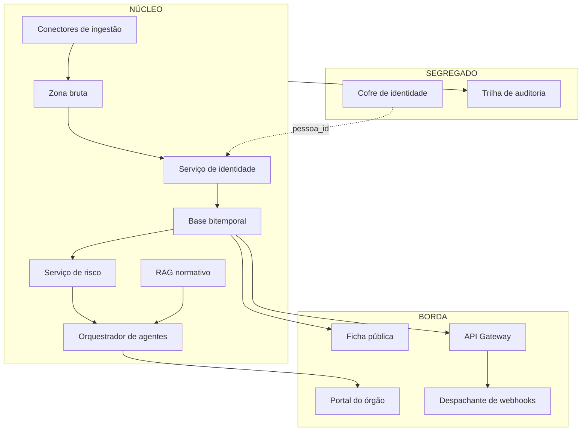

# C4 — Nível 2: Contêineres

Especificação de cada contêiner no formato exigido pelo [plano diretor](../plano-diretor.md) §1.2: responsabilidade, contratos, **o que possui e o que é proibido de possuir**, modos de falha e telemetria mínima. Nível 3 (componentes) existe apenas para Identidade, Agentes e Cofre (ADR-007).

## Diagrama

---

## Conectores de ingestão

| Aspecto | Especificação |
|---|---|
| Responsabilidade | Buscar cada fonte na cadência dela; validar esquema e volume; depositar na zona bruta com data e hash |
| Tecnologia | Python + Dagster (um conector por fonte — Abstract Factory) |
| Possui | Estado de agendamento; catálogo de esquemas esperados |
| **Não possui** | Dado transformado; lógica de negócio; escrita fora da zona bruta |
| Contratos | Entrada: fontes externas (F01–F10). Saída: arquivo bruto + evento `FonteColetada` |
| Modos de falha | Fonte fora do ar (retry+backoff); **esquema mudou** (quarentena + alerta, nunca carga); volume anômalo (dump 30% menor → bloqueia) |
| Telemetria | Última coleta por fonte; taxa de quarentena; atraso vs. cadência esperada |

## Zona bruta

| Aspecto | Especificação |
|---|---|
| Responsabilidade | Preservar todo arquivo como chegou — imutável, datado, com hash (ADR-002) |
| Tecnologia | Parquet/arquivos em objeto + DuckDB para leitura analítica |
| Possui | Todos os bytes de origem; manifesto de linhagem |
| **Não possui** | Transformação; deleção; sobrescrita |
| Contratos | Escrita só pelos conectores; leitura por normalização/reprocessamento |
| Modos de falha | Esgotamento de espaço (previsível — monitorar crescimento) |
| Telemetria | Volume por fonte/mês; verificação periódica de hash |

## Serviço de identidade *(nível 3 obrigatório)*

| Aspecto | Especificação |
|---|---|
| Responsabilidade | Entity resolution: blocking → similaridade → classificação → clusterização → golden record; fila de revisão humana |
| Tecnologia | Python; modelos versionados no MLflow |
| Possui | Clusters versionados; pares candidatos; decisões humanas |
| **Não possui** | CPF completo (recebe `pessoa_id` do cofre); fatos de negócio |
| Contratos | Entrada: registros normalizados. Saída: `posto_id` canônico + `IdentidadeReconciliada` |
| Modos de falha | **Ligação errada** (o pior erro do sistema — limiar conservador + fila humana); deriva de qualidade dos matchers |
| Telemetria | Precisão/recall vs. amostra rotulada; tamanho da fila humana; idade do par mais antigo em revisão |

## Base bitemporal

| Aspecto | Especificação |
|---|---|
| Responsabilidade | Fonte de verdade dos fatos com validade+transação; consultas as-of; snapshots versionados |
| Tecnologia | PostgreSQL + PostGIS + TimescaleDB + pgvector + AGE |
| Possui | Fatos, séries, grafo societário (pseudonimizado), snapshots |
| **Não possui** | CPF; cache como verdade; `UPDATE`/`DELETE` em tabela de fato (ADR-001) |
| Contratos | Escrita via Repository+UoW (fato+auditoria na mesma transação); leitura as-of; detalhes em [modelo-bitemporal](../../dados/modelo-bitemporal.md) |
| Modos de falha | Crescimento de índice temporal (manutenção agendada); consulta as-of sem snapshot em rota quente (proibida em produto) |
| Telemetria | Lag de réplica; razão snapshot-hit; RPO efetivo (idade do último WAL arquivado) |

## Serviço de risco

| Aspecto | Especificação |
|---|---|
| Responsabilidade | Feature store com corte temporal; treino/escoragem; backtesting congelado; detecção de anomalia de preço |
| Tecnologia | Python + MLflow |
| Possui | Features versionadas; modelos com métrica e dado de treino registrados |
| **Não possui** | Feature com vazamento (validação automática de corte); autoridade de publicação (só emite evento) |
| Contratos | Entrada: base bitemporal as-of. Saída: `AvaliacaoDeRisco` + `LimiarDeRiscoCruzado` |
| Modos de falha | Deriva silenciosa (monitor de distribuição); norma mudou e modelo não sabe (escuta `AtoNormativoPublicado`) |
| Telemetria | Precision@k por safra; cobertura por posto; idade do modelo em produção |

## Orquestrador de agentes *(nível 3 obrigatório)*

| Aspecto | Especificação |
|---|---|
| Responsabilidade | Pipeline do caso: Sentinela dispara → Investigador monta → Refutador ataca → Guardião valida → Relator redige; Curador e Analista regulatório em ciclo próprio |
| Tecnologia | Claude via SDK; corrente com veto (Chain of Responsibility) |
| Possui | Casos com linha do tempo; saídas validadas |
| **Não possui** | Acesso ao cofre; canal de publicação fora do Guardião (ADR-008); conteúdo externo como instrução |
| Contratos | Entrada: eventos de risco + consultas as-of + RAG. Saída: `CasoAberto/Refutado/Publicado`, dossiês |
| Modos de falha | Prompt injection via fonte (mitigada por desenho); alucinação de citação (Guardião verifica localizador contra a base) |
| Telemetria | Taxa de refutação; latência por etapa; custo por caso; zero-bypass do Guardião (invariante auditada) |

## RAG normativo

| Aspecto | Especificação |
|---|---|
| Responsabilidade | Corpus de atos vetorizado **por vigência**; resposta sempre com citação + data |
| Tecnologia | pgvector no Postgres |
| Possui | Embeddings versionados por vigência |
| **Não possui** | Interpretação jurídica autoritativa (é apoio, não parecer) |
| Contratos | Entrada: corpus da fonte F08. Saída: trechos com ato, vigência e localizador |
| Modos de falha | Consolidação errada de ato alterador (encadeamento revisado por humano) |
| Telemetria | Cobertura do corpus; idade da última varredura do DOU |

## API Gateway

| Aspecto | Especificação |
|---|---|
| Responsabilidade | Contrato público REST/OpenAPI; autenticação OIDC; ABAC na borda; mascaramento por perfil; rate limit |
| Tecnologia | FastAPI + Keycloak + política central (OPA/Casbin) |
| Possui | Definição OpenAPI versionada; quotas |
| **Não possui** | Regra de negócio; score em resposta sem papel de órgão (ADR-005) |
| Contratos | `?as_of=` em todo recurso histórico; cursor keyset; RFC 9457; `Idempotency-Key` em POST |
| Modos de falha | Token vazado (tokens de 15 min + revogação); scraping (rate limit por chave) |
| Telemetria | p95 por rota; 401/403 por papel; consumo de quota |

## Portais (órgão + ficha pública)

| Aspecto | Especificação |
|---|---|
| Responsabilidade | Órgão: ranking, casos, grafo, contraditório recebido. Pública: fatos datados com fonte, selo, direito de resposta |
| Tecnologia | Next.js (pública em SSG atrás de CDN) |
| Possui | Estado de UI apenas |
| **Não possui** | Dado próprio; qualquer chamada fora do gateway |
| Modos de falha | Ficha pública desatualizada (aceitável — SSG com revalidação por `SnapshotPublicado`) |
| Telemetria | Disponibilidade (SLO 99,9% pública / 99,5% órgão); erro de hidratação |

## Despachante de webhooks

| Aspecto | Especificação |
|---|---|
| Responsabilidade | Entregar eventos assinados aos assinantes com retry, DLQ e replay |
| Tecnologia | Worker + Redis (fila) |
| Possui | Assinaturas; segredos HMAC (rotacionáveis); histórico de entrega |
| **Não possui** | Payload com dado do cofre — nem pseudonimizado quando o assinante é externo |
| Contratos | CloudEvents + HMAC-SHA256; backoff exponencial com jitter até 24h |
| Modos de falha | Assinante fora do ar (DLQ visível + replay sob demanda) |
| Telemetria | Taxa de entrega; idade da DLQ; assinantes com falha crônica |

## Cofre de identidade *(nível 3 obrigatório · zona 2)*

| Aspecto | Especificação |
|---|---|
| Responsabilidade | Guardar CPF completo cifrado; emitir `pessoa_id`; desambiguar homônimos sob fluxo autorizado |
| Tecnologia | Postgres dedicado, rede segregada, envelope encryption com KMS |
| Possui | CPF cifrado; sal do HMAC; log de finalidade |
| **Não possui** | Qualquer dado de negócio; conexão de entrada da zona 1 exceto o fluxo de resolução |
| Contratos | Entrada: fluxos R1/R2/R3. Saída: `pessoa_id` — **nunca** o CPF |
| Modos de falha | Comprometimento (rotação de chave + o sal nunca sai → base analítica permanece pseudônima); indisponibilidade (degrada só a desambiguação, nada mais) |
| Telemetria | Toda consulta com ator+finalidade (a telemetria aqui **é** a trilha); tentativas negadas |

## Trilha de auditoria

| Aspecto | Especificação |
|---|---|
| Responsabilidade | Registro append-only encadeado por hash de toda ação auditável; âncora diária externa |
| Tecnologia | Tabela dedicada + verificação de corrente agendada |
| Possui | Registros encadeados; âncoras publicadas |
| **Não possui** | Escrita retroativa (impossível por construção, não por permissão) |
| Contratos | Escrita na mesma transação do fato (UoW); leitura para auditor |
| Modos de falha | Corrente quebrada = incidente de segurança maior — runbook próprio |
| Telemetria | Última verificação de corrente; última âncora publicada |
