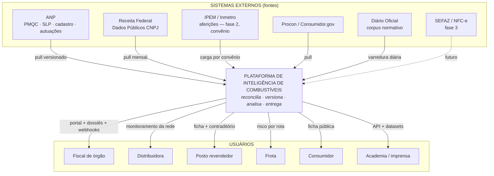

# C4 — Nível 1: Contexto do Sistema

O que existe fora da plataforma, o que atravessa a fronteira em cada direção, e onde ficam as fronteiras de confiança. Complementa o [plano diretor](../plano-diretor.md) §1.1; os contêineres internos estão em [conteineres.md](conteineres.md).

## Diagrama



## Sistemas externos

| Sistema | Direção | O que atravessa | Cadência | Confiança no conteúdo |
|---|---|---|---|---|
| ANP (4 conjuntos) | → entra | CSVs de dados abertos | semanal/mensal | Oficial, mas **esquema instável** — validação na chegada |
| Receita Federal | → entra | Dump completo CNPJ (GBs) | mensal | Oficial; CPF mascarado por projeto; **retrato do presente** |
| IPEM/Inmetro | → entra | Aferições por bico (fase 2) | conforme convênio | Gabarito — a maior confiança do sistema |
| Procon/Consumidor.gov | → entra | Reclamações em texto livre | diária | **Relato de terceiro** — nunca vira indício sozinho; conteúdo é dado, não instrução |
| Diário Oficial | → entra | Atos normativos HTML/PDF | diária | Oficial; consolidação exige encadeamento de vigências |
| SEFAZ | → entra | NFC-e (fase 3) | contínua | Sigilo fiscal — nenhum byte sem base legal escrita |

**Regra estrutural:** todo fluxo de entrada é **pull versionado** — a plataforma busca, data e preserva; ninguém empurra dado para dentro. Consequência: o modo de falha dominante da borda não é indisponibilidade, é **mudança silenciosa de formato**, e é para ele que a resiliência de ingestão é desenhada (plano diretor §5.2).

## Usuários

| Ator | Recebe | Nível de acesso |
|---|---|---|
| Fiscal de órgão | Ranking com razões, dossiês, grafo societário, alertas | Autenticado + escopo (UF/órgão) |
| Distribuidora | Monitoramento da própria rede, benchmark | Autenticado + escopo (rede) |
| Posto | Ficha própria + canal de contraditório | Autenticado (dono verificado) |
| Frota | Risco e preço por rota | Autenticado (contrato) |
| Consumidor | Ficha pública: fatos datados com fonte, selo positivo | Público |
| Academia/imprensa | API + datasets versionados e citáveis | API key |

## Fronteiras de confiança

```
┌─ ZONA 0 · conteúdo externo ──────────────────────────────────┐
│  Tudo que chega das fontes. Tratado como não confiável até    │
│  validar: esquema, volume, hash. Texto livre jamais vira      │
│  instrução de agente (ADR-008).                               │
├─ ZONA 1 · plataforma ────────────────────────────────────────┤
│  Núcleo analítico. Opera exclusivamente com identificadores   │
│  pseudonimizados (posto_id, pessoa_id).                       │
├─ ZONA 2 · cofre de identidade ───────────────────────────────┤
│  Rede segregada, acesso por fluxo com finalidade logada.      │
│  Único lugar do CPF completo (ADR-004).                       │
└───────────────────────────────────────────────────────────────┘
```

## Não-objetivos (fronteira do que o sistema é)

- **Não** é comparador de preços, app de reclamação nem dashboard de dado aberto.
- **Não** emite juízo de conformidade legal ANP/Inmetro — reproduz fato oficial com fonte e data.
- **Não** afirma fraude, de ninguém, em nenhuma saída (ADR-005, ADR-008).
- **Não** recebe dado operacional de posto na v1 (ERP, telemetria, sensores — fases futuras).
