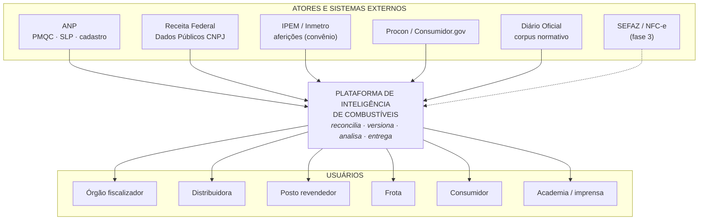
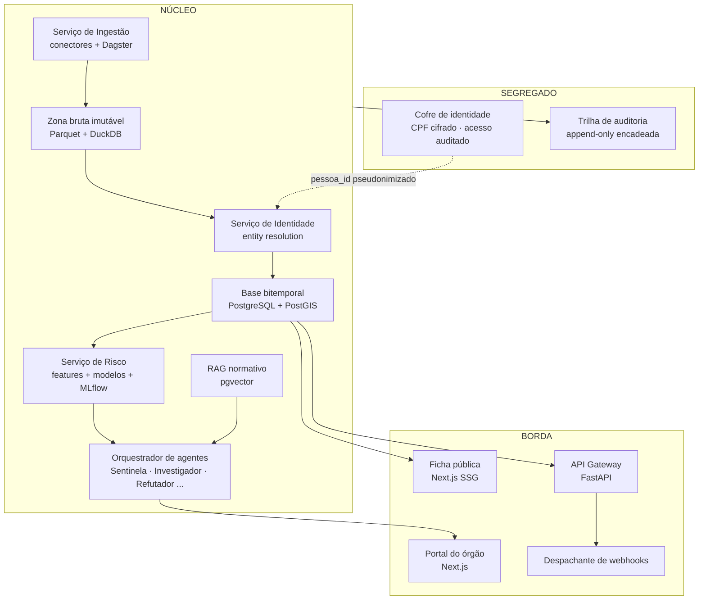
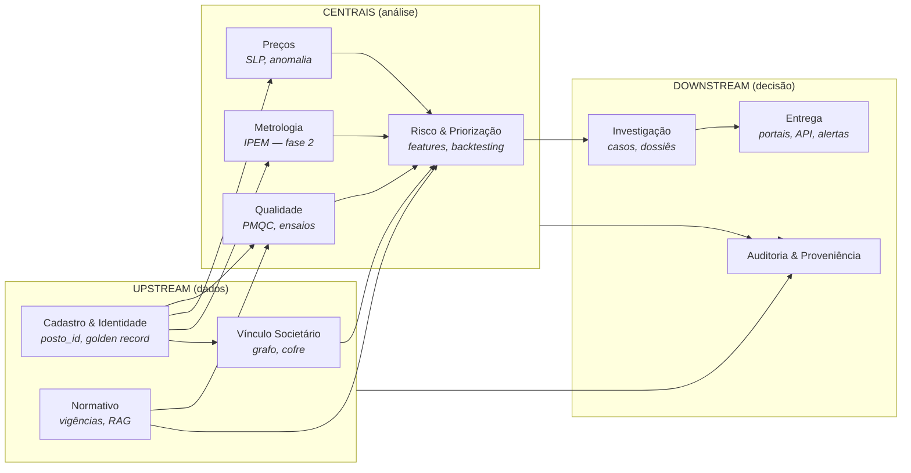

# Plano Diretor de Documentação — Plataforma de Inteligência de Combustíveis

Documento-mestre que define **o que documentar, onde, em que formato e sob qual padrão arquitetural**, para a plataforma descrita em no documento de projeto v1 (nota interna do projeto).

> [!note] Escopo honesto
> O plano cobre a **v1 real** (dados públicos, batch-first, reconciliação, bitemporalidade, agentes) e define **pontos de extensão** para as fases futuras (telemetria de frotas, integração com ERP de postos, sensores). Onde uma tecnologia citada como referência de mercado (ex.: Kafka) **não** se justifica na escala da v1, isso é dito explicitamente — documentação que promete arquitetura que o sistema não tem é passivo, não ativo.

---

## 1. Arquitetura e visão geral do sistema

### 1.1 Visão de Contexto — C4 nível 1



**Regra do diagrama de contexto:** fluxo de dados de fonte externa é sempre *pull* versionado (a plataforma busca; ninguém empurra). Isso muda o desenho de resiliência: o risco não é indisponibilidade de chamada, é **mudança silenciosa de formato** — tratada em §5.2.

### 1.2 Visão de Contêineres — C4 nível 2



Documentos C4 exigidos por contêiner: responsabilidade, contratos de entrada/saída, dados que possui (e que **não** possui — o cofre é definido tanto pelo que contém quanto pelo que o resto do sistema é proibido de conter), modos de falha, telemetria.

**Nível 3 (componentes)** só é exigido para três contêineres onde o risco mora: Identidade (blocking → similaridade → classificador → clusterização → revisão), Agentes (pipeline do caso) e Cofre. O resto do sistema não justifica manutenção de diagrama de componente — regra registrada como ADR-007.

### 1.3 Decisões arquiteturais — ADRs

Formato: MADR simplificado, um arquivo por decisão, imutável após aceito (supersede, nunca edita).

```markdown
# ADR-NNN — Título imperativo curto
Data · Status (proposto/aceito/superado-por-NNN) · Decisores

## Contexto
Que força nos obriga a decidir. Números reais, não adjetivos.

## Decisão
O que fica decidido, em uma frase verificável.

## Consequências
O que ganhamos, o que passamos a dever, o que fica proibido.

## Alternativas rejeitadas
Cada uma com o motivo real da rejeição — é a seção que evita
rediscussão eterna.
```

ADRs fundadores (a escrever antes de qualquer código, porque já foram de fato decididos no projeto):

| ADR | Decisão | Origem |
|---|---|---|
| 001 | Bitemporalidade desde a fundação; toda escrita é aditiva | §5.2 do doc v1 |
| 002 | Zona bruta imutável; reprocessamento sempre possível | princípios do stack |
| 003 | `posto_id` canônico como chave universal; fontes nunca se referenciam entre si diretamente | §5.1 |
| 004 | CPF completo só no cofre segregado; base analítica opera com `pessoa_id` | §7.4.4 |
| 005 | Score de risco restrito a órgãos; público recebe fato + fonte | §9 |
| 006 | Batch-first; mensageria de streaming só quando telemetria existir | §3 deste plano |
| 007 | C4 nível 3 apenas para Identidade, Agentes e Cofre | §1.2 |
| 008 | Toda saída de agente passa pelo Guardião (conformidade de linguagem) antes de persistir | §7.3 do doc v1 |

### 1.4 Componentização — Arquitetura Hexagonal por contexto

Padrão interno de cada serviço: **Hexagonal (Ports & Adapters)**, escolhida em vez de Clean Architecture ortodoxa por uma razão de domínio: o risco dominante do sistema está **nas bordas** (fontes que mudam de formato, órgãos com protocolos próprios), e Hexagonal força a pergunta certa — "qual é a porta e qual é o adaptador?" — em cada integração.

```
┌────────────────────────────────────────────────────────┐
│  ADAPTADORES DE ENTRADA        ADAPTADORES DE SAÍDA    │
│  conector ANP · conector RFB   repositório bitemporal  │
│  API REST · agendador          publicador de eventos   │
│         │                              ▲               │
│         ▼                              │               │
│  ┌──────────────────────────────────────────────┐      │
│  │  PORTAS (interfaces)                         │      │
│  │  ┌────────────────────────────────────────┐  │      │
│  │  │  NÚCLEO DE DOMÍNIO                     │  │      │
│  │  │  entidades · regras · invariantes      │  │      │
│  │  │  sem I/O, sem framework, sem SQL       │  │      │
│  │  └────────────────────────────────────────┘  │      │
│  └──────────────────────────────────────────────┘      │
└────────────────────────────────────────────────────────┘
```

Invariantes de domínio que o núcleo protege (exemplos reais, documentados junto ao código):

- Um fato sem `(tempo_validade, tempo_transacao, fonte, localizador)` completos **não é persistível**.
- Uma aresta societária sem nível (T1–T4) e score de confiança **não existe**.
- Um alerta que não passou pelo Refutador **não é publicável**.
- Feature de grupo societário exclui o próprio posto e respeita corte temporal (anti-vazamento).

---

## 2. Padrões de projeto e domínio

### 2.1 Bounded Contexts (DDD)



| Contexto | Linguagem ubíqua (termos que o glossário fixa) | Relação dominante |
|---|---|---|
| Cadastro & Identidade | golden record, blocking, par candidato, cluster | **Shared Kernel** mínimo: só `posto_id` |
| Vínculo Societário | aresta T1–T4, grupo aparente, `pessoa_id` | Customer/Supplier com Risco |
| Qualidade | amostra, ensaio, não conformidade, lote | Conformist com ANP (o esquema deles manda) |
| Preços | coleta, semana ANP, desvio regional condicionado | Conformist com ANP |
| Normativo | vigência, ato, versão consolidada | Open Host (serve todos via RAG) |
| Risco & Priorização | feature, corte temporal, precision@k, lift | Anti-Corruption Layer contra todos os upstream |
| Investigação | caso, indício, refutação, dossiê | Customer de Risco |
| Auditoria & Proveniência | encadeamento, localizador, as-of | transversal — **nunca** dependência de negócio |
| Entrega | perfil, escopo, assinatura de webhook | Published Language (OpenAPI) |

A regra de ouro documentada no context map: **integração entre contextos só por `posto_id`, `pessoa_id`, eventos de domínio e consultas as-of** — nunca por join direto em tabela alheia.

### 2.2 Padrões aplicados ao domínio

| Padrão | Onde, concretamente | Por que aqui |
|---|---|---|
| **Strategy** | Um matcher de identidade por tipo de evidência (CNPJ exato, endereço normalizado, fonético); um detector de anomalia de preço por segmento (metropolitano/interior/rodovia) | As regras variam por contexto, o contrato não |
| **Abstract Factory** | Criação de conectores de ingestão por fonte; na fase 2, drivers por fabricante de bomba/ATG | Fontes novas não podem exigir toque no núcleo |
| **Adapter + ACL** | Cada fonte externa tem adaptador que traduz o esquema dela para o modelo canônico; o domínio nunca vê CSV da Receita | Proteção contra mudança de formato alheio |
| **Observer / Pub-Sub** | Eventos de domínio: `ColetaPMQCRegistrada`, `MudancaSocietariaDetectada`, `LimiarDeRiscoCruzado`, `AtoNormativoPublicado` → Sentinela, alertas, webhooks | Desacopla detecção de reação; base do tempo-real da fase 2 |
| **Chain of Responsibility** | Pipeline do caso: Investigador → Refutador → Guardião → Relator; qualquer elo pode encerrar | O fluxo é literalmente uma corrente com veto |
| **Specification** | Critérios de elegibilidade de alerta e de inclusão em ranking, compostos com AND/OR/NOT e serializáveis no dossiê | O fiscal precisa ler *por que* o posto entrou na lista |
| **Repository + Unit of Work** | Persistência bitemporal; o UoW garante que fato + trilha de auditoria gravam na mesma transação | Auditoria não pode divergir do dado |
| **Outbox** | Todo evento de domínio grava na mesma transação do fato e é publicado depois | Sem evento fantasma nem evento perdido |
| **Saga (orquestrada)** | Ingestão mensal da Receita: download → validação → diff → carga → reconstrução de grafo, com compensação por etapa | Processo longo, retomável, com estado |
| **Circuit Breaker / Retry+Backoff** | Adaptadores de fonte e, na fase 2, ERP de postos | Ver §5.2 |
| **Snapshot** | Materializações as-of pré-computadas para as consultas do portal | Bitemporal puro é caro de ler; snapshot é cache com data |

**Anti-padrões proibidos por ADR** (tão importante quanto os permitidos): Singleton para conexão/config (quebra teste e reprocessamento); Active Record no domínio (acopla regra a persistência); herança para variação de fonte (é Strategy/Adapter, não subclasse).

### 2.3 Nota honesta sobre os exemplos do enunciado

"Strategy para calculadoras de impostos/margens" e "Factory para marcas de bombas" pertencem a fases futuras (fiscal/telemetria). O plano os registra como **pontos de extensão nomeados** — a porta `CalculadoraTributaria` e a factory `DriverDeBomba` ficam especificadas em `docs/extensao/`, sem implementação na v1. Documentar a porta hoje custa uma página; descobri-la sob pressão custa uma refatoração.

---

## 3. Escalabilidade e engenharia de dados

### 3.1 Dimensionamento real antes de ferramenta

| Fluxo | Volume real | Cadência | Classe |
|---|---|---|---|
| Cadastro ANP | ~40 mil postos | mensal | trivial |
| Preços SLP | ~10⁵ linhas/semana, ~10⁷/ano acumulado | semanal | pequena |
| PMQC | ~10⁵ amostras/ano | mensal | trivial |
| Receita CNPJ | ~60 M empresas, dump de GBs | mensal | **grande em lote** |
| Grafo societário | ~10⁵–10⁶ nós no subgrafo relevante | mensal | média |
| Telemetria (fase 2) | 10⁶–10⁸ eventos/dia | contínua | **streaming real** |

**Consequência (ADR-006):** a v1 é **batch-first**. Kafka/Kinesis na v1 seria arquitetura de fase 2 paga no preço da fase 1 — três brokers para dados que chegam uma vez por mês. O desenho que escala sem retrabalho:

```
v1:  Dagster (orquestração) + Outbox no Postgres + publicação
     de eventos via worker → consumidores internos
                    │
                    ▼  (gatilho: telemetria da fase 2)
v2:  mesmo contrato de evento, transporte trocado por
     Kafka/Redpanda — produtores e consumidores não mudam,
     porque o contrato (CloudEvents + schema registry em
     JSON Schema versionado) foi fixado na v1
```

O que a documentação exige desde já: **catálogo de eventos** (`docs/dados/eventos/`) com esquema, semântica, garantias de ordem e idempotência de cada evento — porque é o contrato, não o transporte, que custa caro mudar.

**Catálogo inicial de eventos de domínio** (a fixar na onda 4; nomes no passado, porque evento é fato consumado):

| Evento | Emitido por | Chave de idempotência | Ordem garantida | Consumidores v1 |
|---|---|---|---|---|
| `FonteColetada` | Ingestão | `(fonte, url, hash_conteudo)` | por fonte | Curador, linhagem |
| `ColetaPMQCRegistrada` | Qualidade | `(posto_id, amostra_id)` | por posto | Sentinela, Risco |
| `PrecoSemanalRegistrado` | Preços | `(posto_id, semana, produto)` | por posto | Detector de anomalia |
| `IdentidadeReconciliada` | Identidade | `(cluster_id, versao)` | global (versão) | todos os contextos |
| `LigacaoIdentidadeRevisada` | Fila humana | `(par_id, decisao_id)` | por par | Auditoria, Identidade |
| `MudancaSocietariaDetectada` | Vínculo Societário | `(cnpj, competencia_dump)` | por CNPJ | Sentinela, Risco |
| `LimiarDeRiscoCruzado` | Risco | `(posto_id, modelo, versao, janela)` | por posto | Investigador |
| `CasoAberto` / `CasoRefutado` / `CasoPublicado` | Agentes | `(caso_id, transicao)` | por caso | Portal, webhooks, Auditoria |
| `AtoNormativoPublicado` | Normativo | `(orgao, ato_id, versao)` | por órgão | Analista regulatório, RAG |
| `SnapshotPublicado` | Entrega | `(versao_snapshot)` | global | Cache, ficha pública, API |

Regras transversais do catálogo: payload **nunca** carrega dado do cofre (nem pseudonimizado quando o evento é assinável por webhook externo); todo evento referencia `posto_id`/`pessoa_id` canônicos, jamais identificador de fonte; consumidor idempotente é obrigação do consumidor — o transporte não deduplica.

### 3.2 Armazenamento por carga de trabalho

| Loja | Tecnologia | O que guarda | Por quê |
|---|---|---|---|
| Zona bruta | Parquet em disco/objeto + DuckDB | Todo arquivo baixado, imutável, datado | Reprocessamento eterno; barato |
| Transacional/bitemporal | PostgreSQL + PostGIS | Fatos com validade+transação, geo | ACID; as-of com SQL; extensão de grafo (AGE) |
| Séries temporais | TimescaleDB (extensão do mesmo Postgres) | Preços, indicadores, telemetria futura | Compressão + continuous aggregates sem segundo banco |
| Vetorial | pgvector (mesmo Postgres) | Corpus normativo para RAG | Um banco a menos para operar |
| Cache | Redis | Sessões, ranking pré-computado, rate limit, resultado de consulta as-of quente | TTL curto; **nunca** fonte de verdade |
| Cofre | Postgres separado, cifrado, rede própria | CPF completo | Isolamento físico, não lógico |

Padrão de cache documentado: **cache-aside com chave versionada** (`ficha:{posto_id}:{versao_snapshot}`) — invalidação por troca de versão, nunca por delete seletivo, porque a versão do snapshot já existe no modelo bitemporal.

### 3.3 Alta disponibilidade proporcional

Documento `docs/operacao/slo.md` fixa: portal do órgão e API 99,5% (horário comercial estendido); ficha pública 99,9% (é estática, CDN resolve); pipelines de ingestão **não têm SLO de latência** — têm SLO de *completude* (dump mensal processado em até 72h da publicação). Postgres com réplica de leitura + failover; RPO 1h (WAL contínuo), RTO 4h. Prometer mais que isso na v1 seria teatro.

---

## 4. Segurança e conformidade (Security-by-Design)

### 4.1 Autenticação e autorização

**OIDC/OAuth2 com Keycloak** (auto-hospedado, alinhado ao stack). Tokens curtos (15 min) + refresh; M2M via client credentials; API pública com API key + quota.

**RBAC como base, ABAC como refinamento** — porque papel sozinho não resolve o caso central: um fiscal do IPEM-SP não pode ver dossiês do Pará. Atributos de escopo (`uf`, `orgao`, `finalidade`) avaliados por política central (OPA ou Casbin), nunca em `if` espalhado.

| Papel | Vê score/ranking | Vê grafo com PF | Consulta cofre | Ficha pública | Exporta dossiê | Administra |
|---|---|---|---|---|---|---|
| Público/consumidor | — | — | — | ✔ | — | — |
| Posto (dono autenticado) | só o próprio | — | — | ✔ + contraditório | — | — |
| Distribuidora | só a própria rede | — | — | ✔ | — | — |
| Frota | rota contratada | — | — | ✔ | — | — |
| Fiscal de órgão | ✔ (escopo UF/órgão) | ✔ (escopo + finalidade logada) | via fluxo R1 | ✔ | ✔ | — |
| Analista da plataforma | ✔ (pseudonimizado) | pseudonimizado | — | ✔ | — | — |
| Auditor | leitura de tudo + trilhas | ✔ | log de acessos | ✔ | — | — |
| Admin | — (segregação de função) | — | — | — | — | ✔ |

A linha do Admin é deliberada: **quem administra não consulta** — segregação de função documentada como controle, não como acidente.

### 4.2 Proteção de dados e LGPD

- **Criptografia:** TLS 1.3 em trânsito (mTLS entre serviços internos); AES-256 em repouso; **envelope encryption** no cofre com chaves em KMS, rotação anual e na saída de qualquer operador.
- **Pseudonimização estrutural:** `pessoa_id = HMAC(sal_do_cofre, CPF)` — o sal nunca sai do cofre; vazamento da base analítica não expõe CPF por construção.
- **Mascaramento por perfil na borda:** o mesmo endpoint retorna `***123456**` ou nada, conforme papel+atributo — política no gateway, não no cliente.
- **Artefatos LGPD obrigatórios** (`docs/conformidade/`): RIPD/DPIA antes da primeira ingestão de QSA; registro de operações (art. 37); base legal por tratamento (legítimo interesse documentado para dado público de sócio, com teste de balanceamento escrito); política de retenção e expurgo automatizado; procedimento de resposta a titular.
- **Regulatório setorial:** a plataforma **não emite** juízo de conformidade ANP/Inmetro — reproduz fato oficial com fonte e data. Essa fronteira (apoio à fiscalização ≠ instrumento legal) é um documento próprio, revisado por jurídico, e é a defesa institucional do projeto.

### 4.3 Trilha de auditoria imutável

Padrão: **append-only com encadeamento de hash** (herança direta da camada L5 do estudo conceitual):

```
registro_n = {seq, timestamp_utc, ator, papel, acao, objeto,
              justificativa?, hash_payload, hash_anterior}
hash_n = SHA-256(registro_n)          ← qualquer alteração quebra a corrente
âncora diária publicada externamente  ← detectável até por terceiros
```

Auditável obrigatoriamente: toda consulta ao cofre (com finalidade), toda mudança de ligação de identidade (quem uniu/separou postos e por quê), toda publicação/retratação de alerta, toda troca de versão de modelo, todo acesso de fiscal a dossiê. Consulta da trilha é permitida; escrita retroativa é **impossível por construção**, não por permissão.

> Alteração de preço e movimentação de estoque, citadas no enunciado, são eventos de sistemas do posto (fase ERP). O padrão acima já os comporta: são novos tipos de `acao` na mesma corrente.

### 4.4 Modelo de ameaças — resumo STRIDE por contêiner

O documento completo (`docs/seguranca/modelo-de-ameacas.md`) desce a fluxo de dados; este resumo fixa a ameaça **dominante** de cada contêiner e o controle que a responde — para que a revisão de segurança comece pelo que mais importa:

| Contêiner | Ameaça dominante (STRIDE) | Cenário concreto | Controle primário |
|---|---|---|---|
| Ingestão | **T**ampering | Fonte comprometida ou MITM entrega dump adulterado | TLS + hash do arquivo na trilha; anomalia de volume; quarentena |
| Identidade | Tampering (lógico) | Ligação forjada/errada funde postos distintos | Fila humana em par ambíguo; `LigacaoIdentidadeRevisada` auditada; reversão as-of |
| Base bitemporal | **R**epudiation | "Esse número não era esse quando publicaram" | Bitemporalidade + snapshot versionado: todo número reproduzível as-of |
| Cofre de identidade | **I**nformation disclosure | Exfiltração de CPF completo | Rede segregada, envelope encryption, acesso por fluxo R1 com finalidade logada, âncora externa da trilha |
| Serviço de Risco | Tampering (dados de treino) | Envenenamento via fonte pública manipulada | Treino só sobre zona bruta versionada; comparação entre versões de modelo; backtesting congelado |
| Agentes | **E**levation via prompt injection | Conteúdo de fonte externa (reclamação, ato em PDF) instrui o agente | Conteúdo externo é sempre dado, nunca instrução; Guardião valida saída; agentes sem acesso ao cofre |
| API / Portal | **S**poofing + **D**oS | Token vazado de fiscal; scraping em massa da ficha pública | OIDC curto + refresh rotativo; ABAC por escopo; rate limit por chave; ficha pública via CDN |
| Webhooks | Spoofing do emissor | Terceiro forja evento para assinante | HMAC com rotação; replay protegido por timestamp+nonce |

Duas ameaças que o STRIDE clássico não captura e o documento completo trata à parte: **conclusão indevida** (o sistema afirmar mais do que a evidência sustenta — mitigada pelo Guardião e pela política de linguagem, §8 do doc v1) e **viés de cobertura** (score calculado sobre dado insuficiente lido como score confiável — mitigada pelo Curador reportando cobertura junto de todo número).

---

## 5. Especificação de APIs e integrações

### 5.1 Padrões de API

- **REST + OpenAPI 3.1** como contrato público (Published Language); GraphQL adiado — federar fontes é o problema que a plataforma já resolve *antes* da API, e GraphQL público complica rate limiting e cache sem demanda real que o justifique (registrado como ADR).
- **Versionamento:** major na URL (`/v1/`), mudanças aditivas sem bump; contrato de depreciação de 12 meses com header `Sunset`.
- **Paginação:** cursor opaco (keyset) em toda listagem — offset é proibido (quebra sob escrita concorrente e convida a full scan).
- **Consulta temporal como cidadã de primeira classe:** todo recurso histórico aceita `?as_of=2025-03-12` — a bitemporalidade aparece no contrato, não só no banco.
- **Idempotência:** `Idempotency-Key` obrigatória em todo POST de efeito (assinaturas de alerta, contraditório).
- **Erros:** RFC 9457 (Problem Details), com catálogo de códigos de domínio versionado junto ao OpenAPI.

```
GET  /v1/postos/{posto_id}?as_of=...          ficha (campos por papel)
GET  /v1/postos/{posto_id}/historico          linha do tempo consolidada
GET  /v1/postos/{posto_id}/grupo              vínculo societário (escopo)
GET  /v1/rankings/fiscalizacao?uf=SP          restrito a órgão
GET  /v1/precos?municipio=...&semana=...      série SLP
POST /v1/webhooks/assinaturas                 registrar endpoint + eventos
GET  /v1/datasets                             dados abertos versionados
```

**Webhooks (extensibilidade):** payload CloudEvents; assinatura HMAC-SHA256 no header com rotação de segredo; retry com backoff exponencial + jitter por até 24h; DLQ visível ao assinante; endpoint de replay. Catálogo de eventos assináveis = subconjunto público do catálogo interno (§3.1).

### 5.2 Resiliência nas integrações

Duas classes de integração, dois documentos distintos:

**Fontes públicas (pull, v1):** o modo de falha não é timeout — é *mudança silenciosa*. Padrões: validação de esquema na chegada + quarentena (nada malformado entra); detecção de anomalia de volume (dump 30% menor = alerta, não carga); retry com backoff para indisponibilidade; **nunca** sobrescrever zona bruta boa com download suspeito.

**Sistemas transacionais (fase 2 — ERP de postos, telemetria):** Circuit Breaker por integração (limiares e semiabertura documentados por parceiro); Rate Limiting em ambas as direções (token bucket no gateway; respeito a limites do parceiro no cliente); Retry + backoff exponencial com jitter **somente** em operações idempotentes — regra de ouro documentada: *retry sem idempotência é duplicação de dado com passos extras*; Bulkhead: pool de conexões isolado por parceiro, para que um ERP lento não derrube a ingestão dos demais.

Cada integração externa ganha um **Runbook de Integração** padronizado: contato do parceiro, contrato de dados, limites, janela de manutenção, procedimento de reconciliação pós-indisponibilidade.

---

## 6. Índice completo da documentação

Repositório `docs/` (MkDocs Material ou GitBook; diagramas Mermaid versionados como texto junto do conteúdo — diagrama binário é diagrama morto):

**Mapa de leitura por persona** (conteúdo do `index.md` — a porta de entrada decide se a documentação é usada ou ignorada):

| Persona | Trilha de leitura (nesta ordem) | Tempo-alvo |
|---|---|---|
| Dev novo no time | `onboarding/comecando` → glossário → ADRs 001–008 → C4 contexto+contêineres → hexagonal do seu contexto | 1º dia |
| Eng. de dados | `dados/modelo-bitemporal` → catálogo de fontes → `entity-resolution` → linhagem → catálogo de eventos | 1ª semana |
| Cientista de dados / ML | `ml/backtesting` → `feature-store` (anti-vazamento!) → governança de modelo → `agentes/catalogo` | 1ª semana |
| Fiscal / órgão parceiro | guia de consumo da API → `politica-de-linguagem` → `fato-vs-score` → runbook de integração do seu órgão | 1 tarde |
| DPO / jurídico | `conformidade/lgpd/` → `cofre-de-identidade` → `fronteira-regulatoria` → trilha de auditoria | 1 tarde |
| SRE / operação | `slo` → runbooks → IaC do ambiente → observabilidade | 1º dia |
| Gestor / orientador | `arquitetura/visao-geral` → decisões de produto → SLOs | 1 hora |

```
docs/
├── index.md                          # mapa de leitura por persona (tabela acima)
├── onboarding/
│   ├── comecando.md                  # ambiente em 1h, dados de exemplo
│   ├── trilha-dev.md                 # 1ª semana: ler ADRs 001-008, subir pipeline local
│   ├── trilha-dados.md               # zona bruta → bitemporal → feature store
│   └── glossario.md                  # linguagem ubíqua (fonte única, linkada de todo doc)
├── arquitetura/
│   ├── visao-geral.md                # este plano, resumido
│   ├── c4/
│   │   ├── contexto.md               # nível 1
│   │   ├── conteineres.md            # nível 2
│   │   └── componentes/              # nível 3 — SÓ identidade, agentes, cofre (ADR-007)
│   ├── adr/
│   │   ├── template.md
│   │   └── adr-001-bitemporalidade.md ... adr-008-guardiao.md
│   ├── hexagonal.md                  # portas, adaptadores, invariantes por contexto
│   └── extensao/                     # pontos de extensão nomeados (fase 2)
│       ├── porta-calculadora-tributaria.md
│       ├── factory-driver-bomba.md
│       └── transporte-streaming.md   # plano de troca outbox→Kafka
├── dominio/
│   ├── context-map.md                # bounded contexts + relações estratégicas
│   ├── contextos/                    # um doc por contexto: agregados, invariantes, eventos
│   ├── padroes.md                    # catálogo do §2.2, com exemplos de código
│   └── anti-padroes.md               # o que é proibido e por quê
├── dados/
│   ├── catalogo-fontes/              # um doc por fonte: esquema, cadência, licença, riscos
│   ├── modelo-bitemporal.md          # semântica as-of, exemplos de consulta
│   ├── entity-resolution.md          # algoritmo, limiares, métricas de qualidade, fila humana
│   ├── grafo-societario.md           # níveis T1-T4, construção, cobertura
│   ├── eventos/                      # catálogo de eventos (contrato CloudEvents + schema)
│   ├── feature-store.md              # features, cortes temporais, anti-vazamento
│   └── linhagem.md                   # da zona bruta ao número publicado
├── ml/
│   ├── modelos/                      # um doc por modelo: dados, métricas, versão, limites
│   ├── backtesting.md                # protocolo precision@k, comparação com baseline
│   └── governanca-de-modelo.md       # promoção, rollback, monitoração de deriva
├── agentes/
│   ├── catalogo.md                   # os 7 agentes: gatilho, entrada, saída, limites
│   ├── pipeline-do-caso.md           # corrente Investigador→Refutador→Guardião→Relator
│   └── politica-de-linguagem.md      # o que nenhuma saída pode afirmar
├── seguranca/
│   ├── modelo-de-ameacas.md          # STRIDE por contêiner
│   ├── iam.md                        # papéis, atributos, matriz do §4.1
│   ├── cofre-de-identidade.md        # arquitetura, fluxos R1/R2/R3, vedações
│   ├── criptografia.md               # em trânsito, em repouso, envelope, rotação
│   └── trilha-de-auditoria.md        # encadeamento, âncora, consultas
├── conformidade/
│   ├── lgpd/                         # RIPD, bases legais, retenção, resposta a titular
│   ├── fronteira-regulatoria.md      # apoio à fiscalização ≠ instrumento legal
│   └── conflito-de-interesses.md     # relação com o projeto acadêmico
├── api/
│   ├── openapi.yaml                  # contrato-fonte (gera referência)
│   ├── guia-de-consumo.md            # auth, paginação, as-of, erros
│   ├── webhooks.md                   # assinatura, retry, replay, catálogo público
│   └── depreciacao.md                # política de versões
├── operacao/
│   ├── iac/                          # Terraform/Ansible + README por ambiente
│   ├── slo.md                        # objetivos do §3.3
│   ├── runbooks/                     # um por cenário: fonte mudou, dump ausente,
│   │                                 #   corrente de auditoria quebrada, failover
│   ├── integracao/                   # runbook padronizado por parceiro externo
│   └── observabilidade.md            # métricas, logs, traces, alertas internos
└── decisoes-de-produto/
    ├── fato-vs-score.md              # decisão do §9 do doc v1 e consequências
    └── recorte-geografico.md
```

**Regras de manutenção** (sem elas o índice apodrece): todo PR que muda porta, evento ou esquema **falha no CI** se não tocar o doc correspondente (verificação por convenção de caminho); ADR novo exige link no índice e revisão de um segundo arquiteto; `glossario.md` é a única fonte de terminologia — docs que redefinem termos são bug.

---

## Ordem de produção sugerida

| Onda | Artefatos | Por quê primeiro |
|---|---|---|
| 1 | ADRs 001–008 · glossário · catálogo de fontes | São as decisões já tomadas; escrever enquanto a memória é fresca custa horas, depois custa arqueologia |
| 2 | C4 contexto+contêineres · context map · modelo bitemporal | Base de todo onboarding |
| 3 | entity-resolution.md · cofre · trilha de auditoria · RIPD | Os três pontos de maior risco técnico e legal |
| 4 | OpenAPI · catálogo de eventos · runbooks de fonte | Contratos com o mundo externo |
| 5 | ml/ · agentes/ · SLOs | Amadurecem junto com a implementação |

---

## Anexo — ADRs

Os oito ADRs fundadores vivem, um por arquivo, em [`adr/`](adr/) — conforme a própria regra deste plano (um arquivo por decisão, imutável após aceito).
