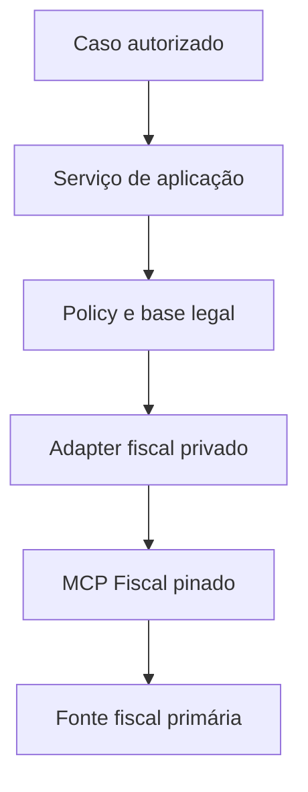

# MCP Fiscal Brasil como adaptador candidato

**Estado:** candidato para prova de conceito; não implementado  
**Última verificação:** 2026-08-26  
**Referência congelada:** `DeHor-Labs/mcp-fiscal-brasil@936846bafc695f48e7b032050a6e37848bbf586c`

## Decisão de enquadramento

O MCP Fiscal Brasil é um software de integração, não uma nova fonte autoritativa da
Plataforma de Inteligência de Combustíveis. Quando consultar Receita Federal, BrasilAPI,
SEFAZ ou outra origem, o fato deve apontar para a fonte primária e para a versão do
adaptador que o obteve.

As fontes F05 (dump mensal de CNPJ) e F10 (SEFAZ/NFC-e restrita) continuam canônicas no
[catálogo de fontes](catalogo-fontes.md). O MCP não substitui sua aquisição bitemporal,
arquivo bruto, base legal ou reconciliação.

## Valor potencial

| Capacidade | Aplicação possível | Limite |
|---|---|---|
| validação de CNPJ e CNAE | validar entrada e apoiar entity resolution | não substitui o dump F05 |
| consulta cadastral pontual | enriquecer uma investigação autorizada | resultado é retrato e pode ter defasagem |
| parsing de NF-e/CT-e | normalizar XML em sandbox ou fonte autorizada | exige proveniência e base legal |
| validação de chave e assinatura | controle de integridade documental | não prova a operação física |
| leitura de SPED | experimento offline autorizado | dado fiscal sensível e de alta criticidade |
| score de fornecedor | nenhum uso decisório | heurística insuficiente para fraude ou compliance |
| manifestação de NF-e | nenhum uso nesta fase | produz efeito externo e requer certificado A1 |

O adaptador não detecta fraude volumétrica, qualidade do combustível, erro metrológico ou
operação efetiva do posto. Esses fatos continuam dependentes de ANP, IPEM/Inmetro,
telemetria, SEFAZ autorizada e análise humana.

## Fluxo candidato

O serviço deve rodar em rede privada, sem acesso direto pelo navegador ou pelo agente ao
certificado digital. O resultado entra pela zona bruta com fonte, timestamp e digest antes
de qualquer transformação.

## Contrato e temporalidade

Campos mínimos da observação:

- `posto_id`, quando já reconciliado, e CNPJ informado;
- tipo do documento ou consulta;
- fonte primária e endpoint lógico;
- commit/versão do adaptador;
- `observed_at`, competência e validade declarada pela fonte;
- hash do original e hash do resultado normalizado;
- status `SUCCESS`, `PARTIAL`, `UNKNOWN` ou `ERROR`;
- base legal e finalidade quando houver dado fiscal restrito;
- regra de transformação e versão do schema.

Consulta pontual de CNPJ é retrato observado e não reconstrói história. Não pode
sobrescrever o histórico mensal de F05. Ausência ou falha permanece `UNKNOWN`.

## Segurança

- bloquear `manifestar_nfe` e qualquer tool de escrita;
- não expor caminho, senha ou conteúdo do certificado A1 ao modelo;
- segredos somente em cofre e injetados no processo isolado;
- usar fixtures sintéticas antes de documentos autorizados;
- aplicar limite de tamanho, XML seguro, timeout e quarentena;
- redigir CNPJ, chaves, nomes e payloads em logs conforme finalidade;
- segregar tenant e ambiente;
- manter kill switch por tool e versão.

Conteúdo de XML e respostas externas é não confiável. Texto fiscal não pode instruir o
agente, alterar policy ou acionar outra ferramenta.

## Falhas, evidência e reconciliação

- Retry apenas para leitura idempotente, com backoff e limite.
- Escrita permanece desabilitada.
- Resposta do MCP não prova aceitação pela fonte ou veracidade econômica.
- Todo resultado relevante deve ser confrontável com o original.
- Divergência com F05, F10 ou cadastro ANP abre fila de reconciliação.
- O sistema nunca conclui fraude a partir dessa integração.

## PoC proposta

1. Congelar imagem e dependências no commit avaliado.
2. Liberar apenas validação de CNPJ, chave fiscal e parsing offline.
3. Usar fixtures sintéticas com casos válidos, inválidos, grandes e maliciosos.
4. Medir latência, falha, consistência do schema e completude da proveniência.
5. Executar uma consulta cadastral pública e comparar manualmente com a fonte.
6. Registrar evidência e decidir entre SDK, REST privado, MCP sidecar ou rejeição.

## Critérios de aceite

- nenhuma tool de efeito disponível;
- nenhum segredo em prompt, argumento ou log;
- schema versionado e testes de contrato;
- proveniência bitemporal preservada;
- resultado não altera score público nem rotula fraude;
- rollback e kill switch testados;
- revisão de segurança, privacidade e domínio concluída.

## Fora de escopo

- integração direta com certificado de produção;
- ingestão de NFC-e sem instrumento jurídico;
- substituição dos conectores oficiais;
- classificação automática de fornecedor ou posto;
- uso do MCP como fonte de verdade.
