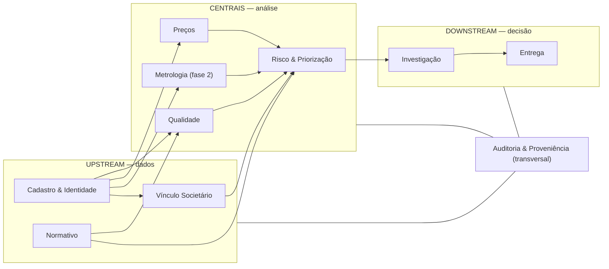

# Context Map — Bounded Contexts e relações estratégicas

Os dez contextos delimitados, suas relações DDD e, para cada um, agregados, invariantes e eventos. Terminologia: [glossário](../onboarding/glossario.md). Um documento completo por contexto entra em `contextos/` nas ondas seguintes.

## Mapa

## Relações estratégicas

| Relação | Contextos | Padrão DDD | Justificativa |
|---|---|---|---|
| Identidade → todos | `posto_id`/`pessoa_id` compartilhados | **Shared Kernel mínimo** | Só os identificadores; nada mais atravessa |
| Qualidade/Preços ← ANP | esquema da fonte manda | **Conformist** | Não controlamos o esquema; o ACL fica na normalização |
| Risco ← todos os upstream | tradução defensiva | **Anti-Corruption Layer** | Features nunca leem tabela alheia — só eventos e consultas as-of |
| Normativo → todos | RAG com citação | **Open Host Service** | Um serviço, todos os consumidores |
| Societário → Risco | features de grupo | **Customer/Supplier** | Risco declara o que precisa; Societário prioriza |
| Investigação ← Risco | casos por evento | **Customer/Supplier** | Gatilho único: `LimiarDeRiscoCruzado` |
| Entrega → mundo | OpenAPI + CloudEvents | **Published Language** | Contrato público versionado |
| Auditoria | transversal | — | Recebe de todos; **nunca** é dependência de negócio de ninguém |

**Regra de ouro:** integração entre contextos **somente** por `posto_id`/`pessoa_id`, eventos de domínio e consultas as-of. Join direto em tabela de outro contexto é violação de arquitetura — falha em revisão, sem exceção.

---

## Ficha por contexto

### Cadastro & Identidade
- **Responsabilidade:** transformar registros de fonte em identidade canônica.
- **Agregados:** `Cluster` (raiz — versionado), `RegistroDeFonte`, `ParCandidato`.
- **Invariantes:** cluster nunca é editado — nova versão; par ambíguo nunca decide sozinho; toda decisão humana referencia o par e fica na trilha.
- **Emite:** `IdentidadeReconciliada`, `LigacaoIdentidadeRevisada`. **Consome:** `FonteColetada`.

### Vínculo Societário
- **Responsabilidade:** grafo de vínculos T1–T4 e grupos aparentes, sobre `pessoa_id`.
- **Agregados:** `GrupoAparente`, `Aresta` (com nível + confiança), `PessoaPseudonimizada`.
- **Invariantes:** aresta sem nível e score não existe; T3 abaixo do limiar vai para revisão; nada aqui contém CPF.
- **Emite:** `MudancaSocietariaDetectada`. **Consome:** `FonteColetada` (dump RFB), `IdentidadeReconciliada`.

### Qualidade
- **Responsabilidade:** fatos do PMQC por posto, produto e ensaio.
- **Agregados:** `Amostra` (raiz) com `Ensaios`.
- **Invariantes:** amostra sem vínculo a `posto_id` reconciliado fica em pendência, não em fato; desenho amostral (dirigido) acompanha todo agregado estatístico.
- **Emite:** `ColetaPMQCRegistrada`. **Consome:** `IdentidadeReconciliada`.

### Preços
- **Responsabilidade:** série semanal de preços e detecção de anomalia condicionada.
- **Agregados:** `ColetaSemanal` (posto × produto × semana ANP).
- **Invariantes:** anomalia sempre condicionada (região × produto × semana × bandeira); cobertura publicada junto de qualquer agregado.
- **Emite:** `PrecoSemanalRegistrado`. **Consome:** `IdentidadeReconciliada`.

### Metrologia *(fase 2 — reservado)*
- **Responsabilidade:** aferições IPEM por bomba/bico — o gabarito metrológico.
- **Agregados:** `Aferição` (por bico, com erro medido).
- **Invariantes:** erro sempre com data, instrumento e rastreabilidade da verificação.
- **Emite/consome:** a definir no convênio; esquema-alvo modelado desde já (catálogo F09).

### Normativo
- **Responsabilidade:** atos com vigência; RAG com citação e data.
- **Agregados:** `Ato` (raiz) com `Vigências` encadeadas.
- **Invariantes:** citação sem vigência é bug; ato alterador encadeia, nunca substitui.
- **Emite:** `AtoNormativoPublicado`. **Consome:** varredura da fonte F08.

### Risco & Priorização
- **Responsabilidade:** features com corte temporal, escoragem, backtesting, ranking.
- **Agregados:** `AvaliacaoDeRisco` (posto × modelo × versão × janela), `FeatureSet`.
- **Invariantes:** feature de grupo exclui o próprio posto; nada posterior ao corte entra; score sem cobertura não é publicável.
- **Emite:** `LimiarDeRiscoCruzado`. **Consome:** quase todos os upstream, via ACL.

### Investigação
- **Responsabilidade:** ciclo do caso — montar, refutar, validar, relatar.
- **Agregados:** `Caso` (raiz: linha do tempo, indícios, refutações, dossiê).
- **Invariantes:** caso não pulado etapa (corrente com veto); dossiê lista hipóteses descartadas e o que não se pode afirmar; nenhuma saída sem Guardião (ADR-008).
- **Emite:** `CasoAberto`, `CasoRefutado`, `CasoPublicado`. **Consome:** `LimiarDeRiscoCruzado`, consultas as-of, RAG.

### Entrega
- **Responsabilidade:** portais, API, webhooks, datasets, snapshots.
- **Agregados:** `Snapshot` (versionado), `Assinatura` (webhook).
- **Invariantes:** rota quente lê snapshot, não bitemporal cru; resposta pública jamais contém score (ADR-005).
- **Emite:** `SnapshotPublicado`. **Consome:** `CasoPublicado` e leituras as-of.

### Auditoria & Proveniência *(transversal)*
- **Responsabilidade:** corrente append-only de toda ação auditável; âncora externa.
- **Agregados:** `RegistroEncadeado`.
- **Invariantes:** grava na mesma transação do fato (UoW); escrita retroativa impossível por construção.
- **Consome:** tudo. **Não emite** eventos de negócio — auditoria não dirige fluxo.
