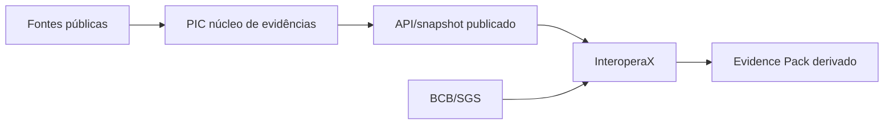

# Fronteira de integração com o InteroperaX

## Estado

Análise arquitetural de não interferência, verificada em 2026-08-28 contra:

- `plataforma-inteligencia-combustiveis-docs@9c80475609bd75f6be50d9a8506ac5ec0c8f9eaf`;
- `plataforma-inteligencia-combustiveis@d14952026c9867d71cd2124168b010c215b7498c`;
- `plataforma-inteligencia-combustiveis-web@6c7ed686b1b7e3fc52837675e714a4a33ad0f4cd`;
- `plataforma-inteligencia-combustiveis-gestao@94a703fbbe10ad70b9814f38d39d5c8cf5c2524e`.

Este documento não altera contrato, banco, runtime ou maturidade. Ele define como testar o InteroperaX sem duplicar o que a PIC já desenvolveu.

## Conclusão

A integração é compatível se a PIC permanecer como sistema de registro do domínio de combustíveis e o InteroperaX atuar como consumidor governado da API, de snapshots publicados e, depois de comprovados, de eventos públicos.

Não é compatível:

- reimplementar F01, F02 ou F03 como fonte canônica dentro do InteroperaX;
- criar outro `posto_id`;
- permitir leitura ou escrita direta nos bancos da PIC;
- importar pacotes internos do backend ou do plano de gestão;
- misturar fato oficial, dado declarado e cálculo derivado;
- publicar score, fraude ou conclusão regulatória por fora do Guardião.

## O que já existe

| Capacidade | Evidência observada | Consequência para a integração |
|---|---|---|
| ANP cadastro F01 | conector, zona bruta, migração e testes | o InteroperaX consome a PIC; não baixa novamente como registro canônico |
| ANP PMQC F02 | conector, fato por amostra/ensaio e pendência de vínculo | preservar `posto_id`, data, amostra, ensaio, fonte e localizador |
| ANP preços F03 | conector, fato semanal e contexto regional | cálculo novo referencia o preço nominal; não o substitui |
| entity resolution | clusters versionados, revisão humana e `posto_id` | não existe reconciliação paralela no InteroperaX |
| bitemporalidade | validade, transação e consulta `as-of` | toda missão fixa `as_of` e `versao_snapshot` |
| API pública | OpenAPI e rotas de postos/preços | fronteira inicial somente leitura |
| portal público | BFF/allowlist e nenhuma conexão ao banco | permanece independente do InteroperaX |
| PIC Gestão | banco próprio, RLS, outbox e publicação governada | não é caminho alternativo para mudar fatos oficiais |
| IBGE F07 | fonte prevista no catálogo | não há conector comprovado na revisão auditada |
| BCB/IPCA | não está no catálogo implementado | usar apenas como evidência derivada do experimento até nova decisão |

## Topologia permitida

O InteroperaX não aparece entre a fonte e a PIC. Ele também não aparece entre PIC Gestão e seus bancos/projetores.

## Regra por fonte

### ANP F01/F02/F03

A PIC continua responsável por descoberta, download, validação de schema, zona bruta, idempotência, vínculo e bitemporalidade. O InteroperaX recebe somente o contrato publicado necessário à missão.

### IBGE F07

F07 já pertence ao roadmap e ao catálogo da PIC. Durante a prova de conceito:

- um mapping temporário pode existir no snapshot da missão;
- ele não grava na PIC;
- o código IBGE é a referência, e nomes são rótulos;
- se virar capacidade permanente, a implementação deve ocorrer sob o catálogo F07, com ADR, migração, testes e contrato compatível.

### BCB/SGS — IPCA candidato

O IPCA serve para comparar preço nominal e real. No experimento:

- preço nominal continua sendo o fato F03;
- série, intervalo, data de coleta, mês-base e fórmula formam uma evidência derivada;
- o valor real não é gravado em `fato_preco_semanal`;
- revisão da série gera novo snapshot, sem sobrescrever resultado anterior.

Se a PIC decidir oferecer esse indicador como produto permanente, deve abrir ADR e ficha de fonte antes de criar `F11` ou mudar o OpenAPI.

## Contrato inicial

O primeiro adapter usa apenas operações públicas de leitura do OpenAPI vigente, como:

- `GET /v1/postos`;
- `GET /v1/postos/{posto_id}`;
- `GET /v1/postos/{posto_id}/contexto-regional`;
- operação de preços definida no contrato canônico.

Requisitos:

- OpenAPI fixado por SHA;
- resposta validada antes do mapping;
- allowlist de campos;
- timeout, cache, circuit breaker, quota e correlação;
- nenhuma `DATABASE_URL` da PIC;
- nenhuma credencial do plano de gestão;
- falha fechada quando a evidência estiver incompleta.

Webhooks e CloudEvents entram apenas quando houver produtor executável, assinatura e teste de replay comprovados. A existência do contrato documental não é suficiente.

## Impacto por repositório

| Repositório | Impacto no primeiro teste |
|---|---|
| `plataforma-inteligencia-combustiveis-docs` | este documento; nenhum contrato alterado |
| `plataforma-inteligencia-combustiveis` | nenhum código ou banco alterado |
| `plataforma-inteligencia-combustiveis-web` | nenhuma alteração |
| `plataforma-inteligencia-combustiveis-gestao` | nenhuma alteração |
| InteroperaX | adapter somente leitura, snapshots e evidência derivada |

## Testes de não interferência

1. O runtime do adapter não contém DSN da PIC.
2. O InteroperaX não importa `pic` nem `pic_gestao`.
3. O mesmo snapshot produz o mesmo resultado e não cria duplicata.
4. Campo novo do upstream não atravessa automaticamente.
5. Indisponibilidade da PIC vira `fonte_indisponivel`, não zero nem ausência de problema.
6. Preço nominal permanece inalterado no pacote de evidências.
7. Cálculo real informa série BCB, mês-base, fórmula e arredondamento.
8. Linguagem que converta preço atípico, atendimento ou amostra isolada em fraude é vetada.
9. Nenhum resultado é publicado diretamente no portal ou nos projetores da PIC Gestão.
10. Teste de carga prova que o demonstrador não degrada a API pública.

## Gates

| Gate | Saída | Mudança na PIC |
|---|---|---|
| `IX-PIC-G0` | fronteira aprovada, OpenAPI congelado e snapshot pequeno selecionado | documentação apenas |
| `IX-PIC-G1` | adapter somente leitura e replay offline | nenhuma, se o contrato atual bastar |
| `IX-PIC-G2` | IPCA como evidência derivada da missão | nenhuma |
| `IX-PIC-G3` | decisão de productização | ADR/contrato somente se aprovado |

O próximo passo recomendado é fechar `IX-PIC-G0`. Não há justificativa arquitetural para alterar os quatro runtimes da PIC antes desse gate.

