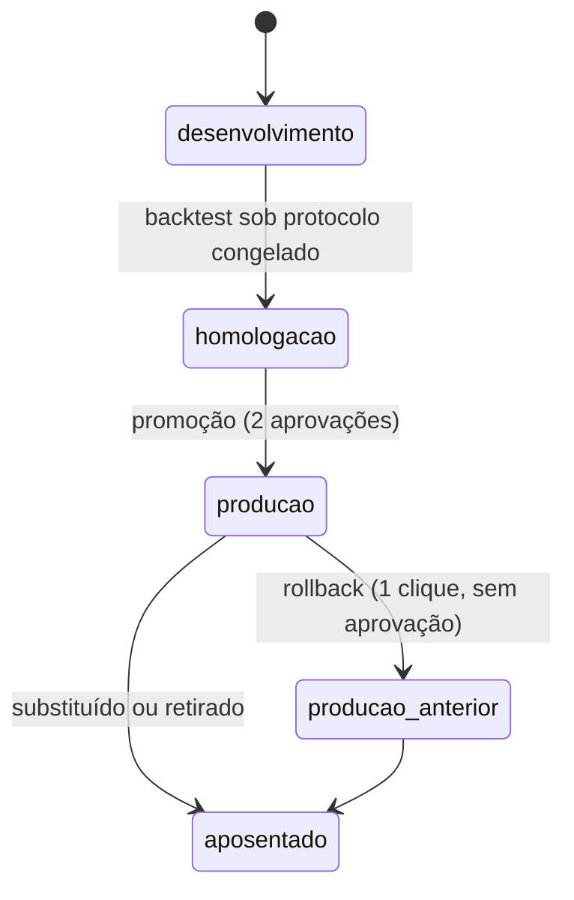

# Governança de Modelo

*(especificação inicial)* — ciclo de vida, promoção, rollback e monitoração de todo modelo do sistema (risco, anomalia de preço, classificador de identidade). Registro: MLflow; trilha: toda transição vai à [corrente de auditoria](../seguranca/trilha-de-auditoria.md).

## Estados e transições

| Transição | Exige |
|---|---|
| → homologação | [Backtest](backtesting.md) executado sob protocolo congelado; model card completo em [`modelos/`](modelos/README.md) |
| → produção | Duas aprovações (quem treinou não aprova sozinho); registro na trilha com métrica citada |
| Rollback | **Nenhuma aprovação** — reverter é sempre barato por desenho; investigar depois |
| Mudança de limiar | Mesmo rito de promoção (limiar é decisão de política, não ajuste técnico) |

## Versionamento nas saídas

Todo evento `LimiarDeRiscoCruzado` e toda `AvaliacaoDeRisco` carregam `(modelo, versao)`. Consequência: dossiês citam a versão que os gerou, e um rollback **não reescreve** avaliações passadas — elas permanecem atribuídas à versão que as produziu, consultáveis as-of. Governança de modelo herda a bitemporalidade do resto do sistema.

## Monitoração de deriva

| Sinal | Janela | Reação |
|---|---|---|
| Distribuição das features de entrada (PSI/KS) | semanal | Alerta do Curador; investigar fonte |
| Distribuição dos scores | semanal | Deslocamento sem causa conhecida → congelar emissão de novos casos até diagnóstico |
| Cobertura média por posto | semanal | Queda = fonte atrasada, não modelo — redirecionar ao runbook de fonte |
| Verdade tardia (resultados de inspeção chegando) | por lote | precision@k realizada vs. prevista; degradação persistente → retreino |
| `AtoNormativoPublicado` com mudança de limite | evento | **Reavaliação obrigatória**: modelo treinado sob norma antiga produz falso positivo em massa sem avisar |

## Retreino

Por gatilho (deriva confirmada, norma mudou, verdade nova relevante), não por calendário fixo. Todo retreino repete o protocolo de backtest completo — não existe "só atualizar os pesos".

## Proibições

- Modelo em produção sem model card — o card é parte do artefato, não documentação posterior.
- Limiar alterado fora do rito — limiar define quem vira caso; é política pública operacionalizada.
- Métrica de venda ("acurácia de 97%") em qualquer material — a única métrica citável é a do protocolo, com baseline e intervalo.
- Feature nova sem validação de corte temporal no feature store — o anti-vazamento é automático ou não é.
