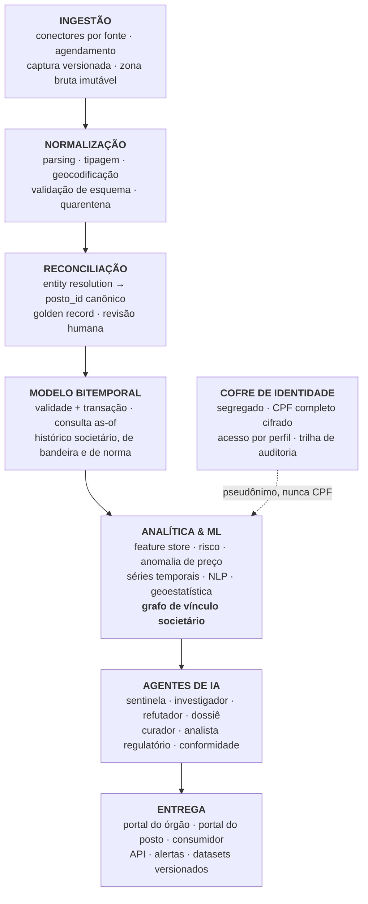

# Plataforma de Inteligência de Combustíveis — v1

Plano de projeto para validação com a USP e o IPEM.

---

## Sumário

- 1. Introdução
- 2. O que a plataforma é
- 3. Setores atendidos
- 4. Fontes de dados da v1
- 5. Os dois problemas técnicos difíceis
- 6. Arquitetura
- 7. Camada de IA
- 7.4 Análise de vínculo societário
- 8. Produtos de saída
- 9. Decisão de desenho pendente
- 10. Stack tecnológico
- 11. MVP e fases
- 12. Critérios de sucesso
- 13. Riscos
- 14. Evolução futura
- 15. Decisões pendentes
- Documentos relacionados

---

## 1. Introdução

Fraude e não conformidade em combustíveis atravessam domínios que não conversam entre si: quantidade entregue é metrologia legal, composição é química analítica, registro é sistema de informação, e a decisão de fiscalizar é ato administrativo. Cada um desses domínios tem seu próprio órgão, seu próprio cadastro e sua própria base de dados.

O resultado é que **a informação necessária para agir já existe, mas não está reunida**. ANP, Inmetro, IPEM estaduais, Procon, Receita Federal e SEFAZ produzem, cada um, um pedaço do retrato — com identificador próprio, formato próprio e periodicidade própria. Ninguém consegue responder de forma confiável a perguntas que deveriam ser triviais:

- Este posto tem histórico de não conformidade?
- Quem é o dono, e que outros postos ele controla?
- Qual norma valia na data em que a amostra foi coletada?
- Entre os postos de uma região, quais merecem fiscalização primeiro?

Hoje essas respostas dependem de consulta manual a várias fontes, de conhecimento tácito de quem está há anos na área, e de sorte. Isso limita o consumidor, que decide no escuro; limita o órgão fiscalizador, que precisa alocar equipe escassa sem critério de risco; limita a distribuidora, que descobre tarde o posto que compromete sua marca; e prejudica o posto idôneo, que compete com quem não cumpre a regra e não tem como demonstrar a diferença.

Este documento propõe uma plataforma que resolve exatamente essa lacuna: **integrar, reconciliar e versionar as fontes existentes, e entregar informação rastreável e inteligência acionável para cada setor interessado**, com monitoramento contínuo por agentes de IA.

A escolha de fundo é começar pelo que já está disponível. Toda a versão 1 se apoia em dados públicos ou obtidos por convênio — nenhuma linha depende de equipamento novo, de sensor instalado ou de adesão de posto.

> [!important] Consequência estratégica
> A v1 **não depende de nenhum parceiro dizer sim**. Cadastro, PMQC e preços da ANP são públicos; a base cadastral da Receita é pública. É possível ter produto funcionando antes de qualquer convênio — e chegar ao IPEM já com algo pronto, o que muda a natureza da conversa: deixa de ser proposta e passa a ser demonstração.

### Como ler este documento

As seções 2 a 5 delimitam o que a plataforma é, para quem, com quais dados e quais são os dois problemas técnicos que decidem seu sucesso. As seções 6 a 8 descrevem arquitetura, camada de IA e produtos de saída. As seções 9 a 15 tratam de execução: decisões pendentes, stack, fases, critérios de sucesso e riscos.

---

## 2. O que a plataforma é

> **Um sistema que integra, reconcilia e versiona todas as fontes públicas e institucionais sobre o mercado de combustíveis brasileiro, produzindo informação rastreável e inteligência acionável para cada setor interessado — monitorada continuamente por agentes de IA.**

**O que não é:** comparador de preços; app de reclamação; dashboard de dado aberto.

**O que é:** a **camada de verdade reconciliada** sobre a dispersão descrita na introdução — uma base em que cada posto tem identidade única e estável, cada fato tem fonte e data, e cada número publicado é reproduzível.

Essa lacuna é técnica antes de ser comercial. É isso que a torna defensável: replicar um comparador de preços é trivial; replicar identidade reconciliada com histórico versionado, não.

---

## 3. Setores atendidos

| Setor | Pergunta sem resposta hoje | Entrega |
|---|---|---|
| **Consumidor** | Este posto tem histórico de problema? | Ficha factual: não conformidades PMQC datadas com fonte, situação cadastral, preço vs. região, direito de resposta do posto |
| **Órgãos fiscalizadores**<br>(IPEM, ANP, Procon, SEFAZ) | Onde fiscalizar primeiro com orçamento limitado? | Ranking de risco com razões, dossiê exportável, mapa de cobertura, alerta de vencimento de aferição |
| **Distribuidoras / bandeiras** | Minha rede tem posto comprometendo a marca? | Monitoramento da rede, alerta precoce, benchmark contra concorrentes |
| **Postos idôneos** | Como provo que sou confiável? | Selo de transparência auditável, benchmark regional, autodiagnóstico |
| **Frotas e transportadoras** | Onde abastecer com menor risco e custo? | Risco + preço por rota, alerta de posto na rota, base para política de abastecimento |
| **Governo / política pública** | Qual o tamanho e a geografia do problema? | Indicadores territoriais, séries históricas, estimativa de gap |
| **Academia / imprensa** | Dados abertos confiáveis e citáveis | API pública, datasets versionados com identificador persistente, metodologia aberta |

> [!note] Armadilha do multi-setor
> Plataforma multi-setor tende a virar sete produtos ruins. O que evita isso: **todos consomem a mesma entidade canônica `posto`** — muda apenas o recorte e o nível de acesso. Uma base, sete visões.
>
> O setor que paga e o que dá legitimidade raramente são o mesmo. Aqui: **órgão e distribuidora pagam; consumidor e academia dão legitimidade.** Desenhar para os quatro desde o início, ou o produto nasce capturado.

---

## 4. Fontes de dados da v1

| Fonte | Conteúdo | Acesso | Papel |
|---|---|---|---|
| **ANP — PMQC** | Amostras coletadas, conformidade por posto, produto, ensaio reprovado | Público | **Rótulo de qualidade** (F2) |
| **ANP — SLP** | Levantamento semanal de preços por posto | Público | Detecção de preço anômalo |
| **ANP — cadastro** | Revendedores autorizados, CNPJ, bandeira, endereço | Público | Espinha dorsal cadastral |
| **ANP — autuações** | Processos e sanções | Público *(verificar granularidade)* | Rótulo de conformidade |
| **Inmetro / IPEM** | Verificações metrológicas, erro por bico, reprovações, lacres | Convênio — fase 2 | **Rótulo metrológico** (F1) |
| **Consumidor.gov / Procon** | Reclamações por empresa e assunto | Público | Sinal precoce, NLP |
| **Receita — Dados Públicos CNPJ** | `EMPRESAS`, `ESTABELECIMENTOS`, `SOCIOS` (QSA), situação cadastral, CNAE, endereço, telefone | Público — dump mensal | **Grafo de vínculo societário** (§7.4) |
| **Receita — identidade do sócio** | CPF completo do sócio PF | **Restrito** — convênio ou via órgão | Resolução de identidade (§7.4.4) |
| **IBGE / geo** | Malha territorial, renda, fluxo | Público | Normalização e contexto |
| **Corpus normativo** | Resoluções ANP, portarias Inmetro, RTM, OIML | Público | **RAG regulatório** |
| SEFAZ / NFC-e | Registro fiscal | Restrito | Fase 3 |

**Nenhuma fonte da v1 depende de app, sensor ou adesão de posto.** É isso que torna o cronograma crível.

### Ativo estratégico

O **IPEM** é o ativo estratégico — não pelo volume, mas por ser a **única fonte de verdade de referência**: é ele que diz qual bomba estava fora de tolerância e por quanto.

> Pedido prioritário no primeiro contato: **série histórica de 5 anos de verificações metrológicas com erro medido por bico.**

Sem rótulo, "IA antifraude" vira detecção de anomalia sem validação.

---

## 5. Os dois problemas técnicos difíceis

Onde está o mérito de engenharia — e onde quase toda plataforma de dado público brasileiro falha.

### 5.1 Entidade canônica: reconciliação de identidade

Um mesmo posto físico aparece:

- na **ANP** como um CNPJ e uma razão social;
- no **PMQC** com nome fantasia abreviado;
- no **Procon** com o nome comercial;
- na **Receita** com outro CNPJ após mudança societária;
- com endereço grafado de cinco formas diferentes.

**Sem resolver isso não existe plataforma — existe planilha.**

É um problema real de *entity resolution*:

```
Blocking geográfico + textual
  → similaridade multi-campo
    (CNPJ, razão social, fantasia, logradouro normalizado,
     CEP, coordenada, bandeira)
  → classificador de pares
    (Fellegi-Sunter probabilístico ou gradient boosting supervisionado)
  → clusterização transitiva
  → golden record com proveniência campo a campo
  → fila de revisão humana para pares ambíguos (active learning)
```

**Saída:** `posto_id` canônico e estável, com histórico de todos os identificadores que já apontaram para ele. Todo o produto pendura nisso.

**Meta de qualidade v1:** precisão ≥ 0,98 e recall ≥ 0,95 em amostra rotulada manualmente.

É publicável por si só e é o ativo que ninguém copia rápido.

### 5.2 Bitemporalidade: nada é atemporal

Um posto muda de dono, de CNPJ, de bandeira. Uma norma muda. Um limite de especificação muda (E30, B15). Dizer *"este posto teve não conformidade"* sem dizer **sob qual dono e sob qual norma vigente** produz injustiça e destrói credibilidade no primeiro questionamento.

**Modelo bitemporal:** todo fato carrega

- **tempo de validade** — quando foi verdade no mundo;
- **tempo de transação** — quando entrou na base.

Toda consulta é *as-of*. Toda mudança é aditiva — nunca sobrescreve.

> [!warning] Decisão de semana 1
> O custo de implantar bitemporalidade depois é proibitivo: reprocessar histórico com regras que mudaram é praticamente impossível. **É decisão de fundação, não de evolução.**

---

## 6. Arquitetura



> [!note] Cofre de identidade fora do fluxo principal
> O cofre é o único componente que pode conter CPF completo. Ele **não** alimenta a base analítica com o dado real — entrega apenas um `pessoa_id` pseudonimizado. Ver §7.4.4.

---

## 7. Camada de IA

Separada deliberadamente por tipo, porque cada peça precisa justificar sua existência.

### 7.1 Aprendizado de máquina clássico

| Modelo | Função | Por que ML e não regra |
|---|---|---|
| **Entity resolution** | Reconciliar identidades entre fontes | Espaço de combinações inviável por regra; melhora com rótulo humano |
| **Risco de não conformidade** | Prever probabilidade de reprovação em inspeção | Interação não linear entre dezenas de covariáveis |
| **Anomalia de preço** | Preço fora da distribuição regional condicionada | Distribuição varia por região, produto, semana, bandeira |
| **Detecção de mudança** | Quando o comportamento do posto mudou | Ponto de mudança em série temporal |
| **Clusterização geoespacial** | Focos territoriais de não conformidade | Descobre padrão que ninguém pediu |
| **Previsão de série** | Tendência de conformidade por região/produto | Planejamento de fiscalização |

#### Features do modelo de risco

- Histórico PMQC — taxa, recência, ensaio reprovado
- Autuações e reincidência
- Tempo desde última verificação metrológica
- Idade e modelo da bomba *(fase IPEM)*
- **Preço persistentemente abaixo da distribuição regional** — sinal clássico
- Volume e teor de reclamações
- Rotatividade societária e de CNPJ
- Bandeira e distribuidora
- Densidade de risco na vizinhança
- Situação cadastral

#### Validação obrigatória

**Backtesting temporal:** treina até $T$, prevê $T+1$, compara com o que realmente foi reprovado.

> [!tip] A métrica que decide tudo
> **Precision@k** — das $k$ fiscalizações recomendadas, quantas resultaram em autuação, comparado com as $k$ que o órgão faria pelo critério atual.
>
> Se com o mesmo orçamento o IPEM encontrar mais irregularidades, o projeto se paga sozinho e o argumento é irrespondível. Esta métrica deve estar no primeiro slide.

### 7.2 LLM — onde linguagem é o problema

- **RAG regulatório** — corpus de resoluções ANP, portarias Inmetro, RTM e OIML, vetorizado e **versionado por vigência**. Responde *"qual especificação de gasolina C valia em 12/03/2025?"* com citação e data. É o corpus normativo do protocolo acadêmico virando produto, útil para todos os setores.
- **NLP sobre reclamações** — classificação de assunto, extração de entidade, detecção de padrão emergente em texto livre.
- **Extração de documentos** — autuações, laudos e atos em PDF viram dado estruturado.
- **Geração de dossiê** — evidência quantificada vira relatório legível e rastreável.

### 7.3 Agentes — monitoramento contínuo

| Agente | Função | Cadência |
|---|---|---|
| **Sentinela** | Vigia ingestão e indicadores; dispara quando limiar é cruzado | Contínuo |
| **Investigador** | Monta o caso: reúne fontes, reconstrói linha do tempo, busca corroboração cruzada | Sob disparo |
| **Refutador** | Tenta **derrubar** o indício: mudou de dono? norma mudou? amostra pequena? sazonalidade? erro de reconciliação? Só passa o que sobrevive | Antes de todo alerta |
| **Dossiê** | Redige: achado, evidência, rastreabilidade, hipóteses descartadas, o que **não** se pode afirmar | Sob demanda |
| **Curador de dados** | Cobertura, deriva, atraso de fonte, qualidade da reconciliação; alerta de score com dado insuficiente | Diário |
| **Analista regulatório** | Monitora Diário Oficial e sites dos órgãos; detecta ato novo; avalia impacto nos modelos e limites | Diário |
| **Conformidade** | Verifica LGPD, retenção, e que nenhuma saída afirme mais do que a evidência sustenta | Toda saída |

> [!important] Os dois agentes que fazem diferença
> **Refutador** — todo sistema produz alerta; quase nenhum produz alerta **já submetido a tentativa sistemática de derrubada**. É o que faz um fiscal confiar no ranking em vez de ignorá-lo. É a proposição P5 do protocolo acadêmico (*anomalia não é fraude*) virando software.
>
> **Analista regulatório** — impede o apodrecimento silencioso. Numa base cujos limites mudam (E30, B15), um modelo treinado sob norma antiga produz falso positivo em massa sem avisar ninguém.

---

## 7.4 Análise de vínculo societário

### 7.4.1 O problema e o valor

Identificar fraude em **um** posto responde pouco. A pergunta que importa é:

> *Quem é o dono, quantos outros postos ele tem, e de quais outras empresas com postos ele participa?*

Isso transforma um achado pontual em **mapa de fiscalização**. É a funcionalidade de maior retorno da plataforma, é 100% baseada em dado público e não depende de app, sensor ou convênio.

### 7.4.2 Níveis de certeza do vínculo

Este é o ponto que separa ferramenta útil de máquina de acusação injusta. **Os níveis não podem ser misturados.**

| Nível | Vínculo | Como se obtém | Certeza |
|---|---|---|---|
| **T1** | **Filiais** — mesmo dono, mesma empresa | Mesmo **CNPJ básico** (8 primeiros dígitos), `ordem` diferente | **Determinística** |
| **T2** | **Sócio pessoa jurídica** | `SOCIOS` com identificador = 1 traz o **CNPJ completo** da PJ sócia | **Determinística** |
| **T3** | **Sócio pessoa física** | Nome completo + CPF parcial | **Probabilística** ⚠️ |
| **T4** | **Coincidência operacional** | Mesmo endereço, telefone, e-mail, representante legal | **Indiciária** |

Toda aresta carrega seu nível e um score de confiança. Abaixo do limiar, vai para fila de revisão humana — nunca direto para o dossiê.

> [!warning] O T4 é o mais revelador e o mais perigoso
> Mesmo endereço e telefone entre CNPJs distintos é a assinatura de estrutura de fachada — e também de prédio comercial compartilhado e de contador que cadastra o próprio telefone em dezenas de clientes. **Nunca é prova; é gatilho de investigação.**

### 7.4.3 Algoritmo de construção do grafo

Não é necessário processar o grafo nacional. O subgrafo relevante é pequeno.

```
1. SEMENTE
   Todos os CNPJs de revendedores do cadastro ANP (~40 mil)

2. EXPANSÃO k-hop pelo grafo de sócios
   posto → sócios (PF e PJ) → outras empresas do sócio
        → sócios dessas → ...   (k = 2 ou 3)

3. INTERSECÇÃO
   Quais nós alcançados são também postos?

4. COMPONENTES CONEXOS
   Cada componente = grupo societário aparente

5. MÉTRICAS
   centralidade (quem é o hub) · tamanho · dispersão geográfica
   idade média · rotatividade
```

O passo 2 responde ao caso de dois saltos: **posto A → sócio → empresa B → posto C**.

**Implementação:** dado o tamanho, `union-find` em memória resolve. Para consulta de caminho no banco, **Apache AGE** (extensão de grafo do PostgreSQL) mantém o stack já previsto, sem introduzir Neo4j.

### 7.4.4 Sistema de resolução de identidade do sócio

**Componente obrigatório do projeto.**

#### Por que é necessário

Na base pública da Receita o **CPF do sócio vem mascarado** — apenas os dígitos centrais. Isso significa que toda aresta **T3** é probabilística: liga-se por *nome completo + CPF parcial*. É quase único, mas "quase" não basta quando a saída é uma lista de fiscalização, e homônimos existem.

Sem resolução de identidade, três coisas ficam comprometidas:

1. **Precisão do grafo** — homônimos criam grupos falsos, e grupos falsos geram fiscalização indevida.
2. **Acionabilidade do dossiê** — o fiscal precisa de identificação inequívoca para agir.
3. **Detecção de reincidência migrante** — a mesma pessoa reaparecendo em novo CNPJ só é detectável com identificador estável.

#### Rotas legítimas

| Rota | Descrição | Quando usar |
|---|---|---|
| **R1 — Resolução delegada ao órgão** | A plataforma entrega o *cluster candidato* com nome + CPF parcial; o **órgão** confirma com seus próprios meios legais (convênio Receita/Infoconv). A plataforma nunca toca sigilo fiscal | **Recomendada para a v1** |
| **R2 — Convênio ou contrato próprio** | Acesso contratado a serviço oficial de consulta/validação cadastral, ou convênio via o órgão parceiro | Quando houver instrumento formal e base legal documentada |
| **R3 — Requisição no caso concreto** | Requisição administrativa ou judicial dentro de um procedimento específico | Casos individuais em investigação formal |

> [!danger] Rotas vedadas — sem exceção
> - Serviços de "consulta CPF" de mercado cinza
> - Bases vazadas ou compradas
> - **Reconstrução técnica dos dígitos ocultos.** O mascaramento é uma proteção deliberada do controlador dos dados; contorná-la por meio técnico caracteriza tratamento incompatível com a finalidade, expõe o projeto a sanção da LGPD e destrói sua credibilidade institucional — que é justamente o ativo que torna a plataforma útil a um órgão fiscalizador.
>
> Alguém da equipe vai perceber que isso é tecnicamente trivial. Por isso está escrito aqui: **a rota é jurídica, não técnica.**

#### Arquitetura do módulo

```
┌── COFRE DE IDENTIDADE (segregado) ──────────────────────┐
│  · CPF completo cifrado em repouso                      │
│  · acesso por perfil, nunca por aplicação               │
│  · finalidade registrada em cada consulta               │
│  · trilha de auditoria imutável (quem, quando, por quê) │
│  · retenção definida e expurgo automático               │
└──────────────────────┬──────────────────────────────────┘
                       │ entrega SOMENTE
                       ▼
              pessoa_id  (hash com sal)
                       │
                       ▼
┌── BASE ANALÍTICA ───────────────────────────────────────┐
│  grafo, features, modelos e dossiês usam apenas         │
│  o pseudônimo — nunca o CPF real                        │
└─────────────────────────────────────────────────────────┘
```

**Princípio:** a base analítica **nunca** armazena CPF completo. Ela opera sobre `pessoa_id` pseudonimizado. O cofre existe para (a) desambiguar homônimos e (b) permitir que um usuário autorizado, dentro de procedimento formal, veja a identidade real.

#### Funcionalidade de consulta

| Consulta | Entrada | Saída | Acesso |
|---|---|---|---|
| **Busca por pessoa** | Nome, CPF ou `pessoa_id` | Todas as empresas, postos, participações e datas de entrada/saída | Órgão |
| **Linha do tempo da pessoa** | `pessoa_id` | Histórico societário completo, com ocorrências (autuações, não conformidades) posicionadas no tempo | Órgão |
| **Busca por posto** | CNPJ ou `posto_id` | Quadro societário *as-of* qualquer data; grupo societário aparente | Órgão |
| **Busca por grupo** | `grupo_id` | Todos os postos, mapa geográfico, histórico consolidado | Órgão |
| **Grafo de vizinhança** | Qualquer nó, raio $k$ | Rede visual com nível e confiança de cada aresta | Órgão |

Toda consulta que toque identidade de pessoa física é logada com finalidade declarada. Visão pública, se existir, mostra **empresa** — nunca pessoa física.

### 7.4.5 Histórico societário próprio — ação imediata

> [!important] O item mais tempo-sensível do projeto inteiro
> **A base da Receita é um retrato do presente, não um histórico.** Ela mostra os sócios de hoje. Sócio que saiu simplesmente desaparece do arquivo — não há registro de que já esteve lá.
>
> Para uma plataforma cujo princípio é *"sob qual dono e sob qual norma"*, isso é fatal. A única solução é **capturar os dumps mensais e construir o histórico próprio**.
>
> **Cada mês não arquivado é história societária perdida para sempre.** Isso pode começar antes de qualquer decisão de arquitetura — é só armazenamento. Ver F0.

Amarra diretamente à decisão de bitemporalidade (§5.2): o grafo societário precisa ser consultável *as-of* qualquer data.

### 7.4.6 Features derivadas para o modelo de risco

- `n_postos_do_grupo`
- `taxa_nao_conformidade_do_grupo` — **excluindo o próprio posto**
- `grupo_tem_posto_autuado_ultimos_12m`
- `distancia_no_grafo_ate_posto_autuado`
- `rotatividade_societaria_12m`
- `socio_aparece_em_n_empresas`
- `idade_media_das_empresas_do_socio`
- `mesmo_endereco_de_cnpj_baixado_com_autuacao`
- `nivel_do_vinculo` (T1–T4) e confiança da aresta

> [!danger] Vazamento de dado — erro clássico
> Ao calcular "taxa de não conformidade do grupo" como feature, é obrigatório **excluir o próprio posto** e **respeitar o corte temporal** — só eventos anteriores à data da predição. Sem isso o backtest fica excelente e o modelo não vale nada em produção.

### 7.4.7 Padrões de evasão detectáveis

| Padrão | Assinatura no grafo |
|---|---|
| **Sucessão de fachada** | CNPJ baixado após autuação; novo CNPJ abre no **mesmo endereço/telefone** em poucos meses |
| **Rotatividade defensiva** | Troca do quadro societário logo após autuação |
| **Perfil de laranja** | Sócio em muitas empresas, todas de vida curta e capital baixo |
| **Pulverização** | Controlador de fato distribuído em vários CNPJs para diluir histórico |
| **Reincidência migrante** | Mesmo grupo autuado em municípios diferentes ao longo do tempo |

O primeiro é o mais valioso: hoje, baixar o CNPJ e reabrir é forma eficaz de zerar histórico. O grafo com histórico próprio impede isso.

### 7.4.8 Hipótese testável na F2

> **A não conformidade se concentra por grupo societário mais do que o acaso explicaria?**

Mensurável direto com o histórico de IPEM e PMQC: dado que um posto foi reprovado, qual a probabilidade de um posto irmão também ser — comparada com a taxa base da região?

- **Lift significativo** → feature validada + achado publicável.
- **Sem lift** → meses de desenvolvimento economizados.

Depende **apenas de dado retrospectivo**. Cabe inteiro na F2, sem app, sensor ou convênio novo. É o tipo de resultado que se leva pronto para a reunião com o IPEM.

### 7.4.9 Limites e cobertura

**Epistêmico.** Fraude em um posto **não** é evidência de fraude nos irmãos. É elevação de probabilidade *a priori* — insumo de **priorização**, jamais de acusação. É a proposição P5 do protocolo acadêmico outra vez: vínculo não é fraude.

**Jurídico.** "Grupo econômico" tem definição legal específica. O que a plataforma constrói é **vínculo societário aparente**. O agente Conformidade bloqueia qualquer saída que afirme mais que isso.

**LGPD.** O grafo de sócios PF é dado pessoal — público, mas pessoal. Consequências:
- Rede com pessoas identificadas **restrita a órgãos**, com base legal definida e avaliação de legítimo interesse documentada.
- Visão pública mostra **empresa**, nunca pessoa física.
- Ligar pessoa física nomeada a "fraude" é o **maior risco jurídico do projeto** — maior que qualquer score de posto.

**Cobertura.** Nem todo posto terá quadro societário legível: sociedades anônimas informam administradores, não acionistas; algumas naturezas jurídicas têm QSA reduzido; participações via fundos ou holdings no exterior ficam opacas. O Curador de dados precisa reportar **qual fração do parque tem vínculo mapeável**, para que ninguém leia "sem vínculo encontrado" como "posto isolado".

---

## 8. Produtos de saída

- **Ficha do posto** — factual, datada, com fonte por afirmação e direito de resposta
- **Score de risco** — restrito a órgãos, com intervalo de confiança, top-$k$ razões e cobertura de dado
- **Ranking de fiscalização** — priorização com ganho esperado
- **Mapa de vínculo societário** — grupo aparente, rede visual, linha do tempo da pessoa e do grupo *(restrito a órgãos)*
- **Mapa de calor** — territorial e temporal
- **Painel de preço anômalo**
- **Índices agregados** — municipal, regional, por distribuidora, por produto
- **Alertas** por perfil de assinante
- **API + datasets versionados** com identificador persistente
- **Boletim automático** gerado pelos agentes

---

## 9. Decisão de desenho pendente

### Score público por posto, ou apenas fato público por posto?

| Abordagem | Conteúdo | Risco |
|---|---|---|
| **Fato** | *"Amostra não conforme em 12/03/2026 — fonte ANP/PMQC, ensaio X"* | Baixo — reproduz dado já público, datado e citado |
| **Score** | *"Risco alto"* | **Alto** — é inferência própria sobre agente identificado; dano à imagem e ação judicial são risco real, não teórico |

**Recomendação:** score **restrito a órgãos**; público recebe **fato + selo positivo de transparência**, nunca rótulo pejorativo.

Reconhecimento de quem vai bem em vez de pelourinho de quem vai mal: mesma informação, risco jurídico incomparavelmente menor, e adesão do setor em vez de guerra com ele.

É escolha de posicionamento, não técnica. Depende do apetite da USP e do IPEM. **Fechar na reunião.**

---

## 10. Stack tecnológico

### Núcleo pragmático

| Camada | Tecnologia |
|---|---|
| Linguagem | Python |
| Armazenamento | PostgreSQL + PostGIS (modelo bitemporal) |
| Transformação | dbt |
| Orquestração | Dagster ou Prefect |
| Análise local | DuckDB |
| Versionamento de modelo | MLflow |
| Busca vetorial | pgvector |
| API | FastAPI |
| Front | Next.js |
| Agentes e NLP | Claude |
| Infra | Docker + CI |

### Princípios não negociáveis

1. Zona bruta **imutável**
2. Toda transformação versionada em Git
3. Todo modelo com versão, dado de treino e métrica registrados
4. Toda saída rastreável ao registro de origem
5. **Reprodutibilidade de qualquer número publicado, em qualquer data passada**

O princípio 5 é o que permite responder a um posto que conteste um número seis meses depois. Sem ele, a plataforma perde a primeira discussão séria que tiver.

---

## 11. MVP e fases

| Fase | Duração | Entrega | Critério de saída |
|---|---|---|---|
| **F0** Fundação | 4 sem | Ingestão ANP (PMQC, SLP, cadastro) + Receita; zona bruta versionada; modelo bitemporal | Base reprocessável de ponta a ponta |
| **F1** Reconciliação | 6 sem | Entity resolution; `posto_id` canônico; golden record; **grafo de vínculo societário (T1–T4)** | **Precisão ≥ 0,98 / recall ≥ 0,95** em amostra rotulada |
| **F2** Analítica | 6 sem | Risco, anomalia de preço, séries, geoestatística; **teste da hipótese de concentração por grupo** (§7.4.8) | **Precision@k > baseline** em backtesting |
| **F3** Agentes | 6 sem | Sentinela, Refutador, Investigador, RAG regulatório | Dossiê avaliado como acionável por fiscal real |
| **F4** Entrega | 6 sem | Portal do órgão, ficha pública, API, alertas | 1 órgão + 1 distribuidora em piloto |
| **F5** IPEM | paralelo | Convênio e integração de dados metrológicos | Rótulo F1 incorporado ao modelo |

**≈ 7 meses até plataforma operante**, sem depender de app, sensor ou adesão de posto.

> [!important] Ação que começa antes da F0
> **Arquivar os dumps mensais dos Dados Públicos CNPJ da Receita a partir de agora.** Não depende de decisão de arquitetura, de convênio nem de orçamento — é só armazenamento. Cada mês não capturado é histórico societário perdido de forma irreversível (§7.4.5).

---

## 12. Critérios de sucesso

- Qualidade da reconciliação — precisão/recall com amostra rotulada
- **Precision@k** do ranking contra o critério atual do órgão em backtesting
- Cobertura — % do parque nacional com ficha completa
- Latência de detecção — dias entre o fato ocorrer na fonte e o alerta ser emitido
- Rastreabilidade — 100% dos números publicados reproduzíveis *as-of* qualquer data
- Adoção — órgãos, distribuidoras e frotas ativos
- Zero afirmações não sustentadas por evidência (auditoria do agente Conformidade)

---

## 13. Riscos

| # | Risco | Mitigação |
|---|---|---|
| 1 | **Formato e estabilidade das fontes públicas** — publicação muda sem aviso | Conectores com validação de esquema, quarentena e alerta do Curador |
| 2 | **Reconciliação errada** — atribuir a um posto o histórico de outro. *O pior erro possível* | Revisão humana em pares ambíguos, limiar conservador, correção rastreável |
| 3 | **Jurídico e reputacional** | Ver 9. Decisão de desenho pendente; contraditório e política de linguagem |
| 4 | **LGPD** — dados de sócios da Receita são pessoais mesmo sendo públicos | Finalidade e base legal definidas **antes** da ingestão; cofre segregado; pseudonimização na base analítica |
| 4a | **Identidade de pessoa física ligada a "fraude"** — o maior risco jurídico do projeto | Rede com PF restrita a órgãos; linguagem de vínculo aparente; agente Conformidade bloqueando; visão pública sem PF |
| 4b | **Tentação da rota técnica para o CPF mascarado** | Vedação explícita em §7.4.4; resolução por R1/R2/R3, nunca por contorno do mascaramento |
| 4c | **Homônimos no vínculo T3** gerando grupo falso e fiscalização indevida | Score de confiança por aresta, limiar conservador, fila de revisão humana, resolução de identidade antes do dossiê |
| 5 | **"Isso já não existe?"** — existem comparadores de preço | Nenhum reconcilia identidade entre fontes, versiona no tempo ou produz risco auditável. A diferenciação vai no primeiro slide |
| 6 | **Sustentabilidade** | Modelo de receita ou financiamento institucional definido antes, não depois |

---

## 14. Evolução futura

A v1 foi desenhada para ser **fundação, não etapa isolada**. Cinco de seus ativos são pré-requisito de qualquer captura de dado em campo que venha depois — sensores, telemetria de frota ou aplicativo de consumidor:

| Ativo da v1 | Por que é pré-requisito |
|---|---|
| `posto_id` canônico + bitemporalidade | Chave de junção de qualquer dado novo, com a data certa |
| Rótulos IPEM + PMQC | Verdade de referência — sem ela nenhum sinal novo se valida |
| Modelo de risco + backtesting | Baseline contra o qual todo sinal futuro precisa provar ganho |
| Agentes e dossiê | Camada de decisão já construída e testada |
| Trilha de proveniência ponta a ponta | Base para auditoria e cadeia de custódia |
| Corpus normativo versionado | Contexto regulatório aplicável por data |

Qualquer fonte de dado adicionada depois **pluga** numa plataforma que já sabe quem é cada posto, o que já aconteceu ali e o que a norma exigia em cada data — em vez de precisar construir isso do zero.

> O detalhamento das etapas posteriores (app de abastecimento e estudo das cinco camadas) é mantido em nota interna do projeto, não publicada neste repositório.

---

## 15. Decisões pendentes

Para fechar na reunião:

1. **Score público ou apenas fato público** (§9) — muda o produto, o risco jurídico e a relação com o setor.
2. **Recorte geográfico da v1** — Brasil inteiro com dado ANP, ou um estado (São Paulo, aproveitando o IPEM-SP) para profundidade?
   - Nacional dá alcance; estadual dá rótulo metrológico e parceiro institucional próximo.
   - *Recomendação:* nacional para os dados ANP, com **São Paulo como recorte profundo de validação**.
3. **Instrumento de parceria com o IPEM** — convênio, TED ou acordo de cooperação?
4. **Rota de resolução de identidade do sócio** (§7.4.4) — R1 (órgão resolve, plataforma não toca sigilo) ou R2 (convênio próprio)?
   - *Recomendação:* **R1 na v1.** Mantém a plataforma fora do sigilo fiscal e transfere a etapa sensível para quem já tem competência legal. R2 só se o convênio com o IPEM vier a contemplá-lo explicitamente.
5. **PI, titularidade e autoria** — definir **antes** de qualquer código, com NIT/USP.
6. **Modelo de sustentação** — receita, fomento ou institucional.

---

## Documentos relacionados

- [Plano Diretor de Documentação](arquitetura/plano-diretor.md) — C4, DDD, ADRs, segurança, APIs e árvore de docs
- [Glossário](onboarding/glossario.md) · [Catálogo de Fontes](dados/catalogo-fontes.md)
- Nota de contexto (app adiado) e protocolo de pesquisa das cinco camadas — documentos internos do projeto, não publicados neste repositório.
